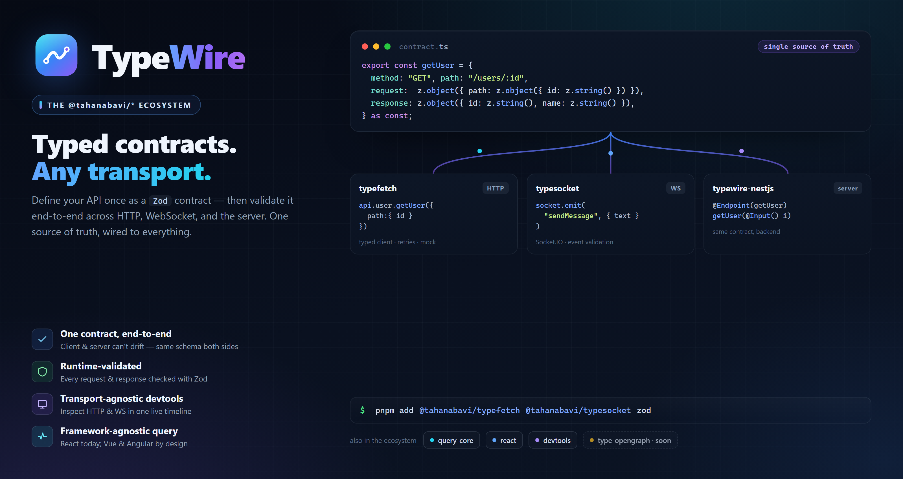
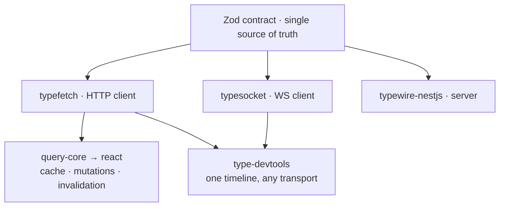

<div align="center">



<br/>

**One Zod contract, validated end-to-end — across HTTP, WebSocket, and the server.**

[](https://www.npmjs.com/package/@tahanabavi/typefetch)
[](https://www.npmjs.com/package/@tahanabavi/typesocket)
[](./LICENSE)
[](https://pnpm.io)
[](https://zod.dev)

[Packages](#packages) · [Quick start](#quick-start) · [Why TypeWire](#why-typewire) · [Architecture](#architecture) · [Development](#development) · [Roadmap](#roadmap)

</div>

---

## What is TypeWire?

**TypeWire** is a family of small, strongly-typed packages that all speak one
language: **contracts**. You describe an endpoint once with [Zod](https://zod.dev)
— method, path, request, response — and every package in the ecosystem consumes
that same object:

- the **client** validates on the way out,
- the **server** validates on the way in,
- a **query layer** caches it, and
- **devtools** inspect it.

The route can't drift from the client, the client can't drift from the types, and
the types can't drift from what's validated at runtime. Everything ships under the
`@tahanabavi/*` npm scope.

## Packages

| Package | Status | What it does |
| --- | --- | --- |
| [`@tahanabavi/typefetch`](./packages/typefetch) | ✅ published | Strongly-typed **HTTP** client — middleware, retries, mock mode, typed errors, contract testing, CLI. |
| [`@tahanabavi/typesocket`](./packages/typesocket) | ✅ published | Type-safe **Socket.IO / WebSocket** wrapper — Zod event validation, middleware, queued emits. |
| [`@tahanabavi/typewire-nestjs`](./packages/nestjs) | 🔁 migrated | **NestJS** backend — bind routes & validate request/response from the same contracts (was `typefetch-nestjs`). |
| [`@tahanabavi/typefetch-query-core`](./packages/query-core) | 🚧 in dev | Framework-agnostic **query engine** — cache, dedup, staleness, mutations, auto-invalidation. |
| [`@tahanabavi/typefetch-react`](./packages/react) | 🚧 in dev | Thin **React** adapter — `useQuery` / `useMutation` / `TypeFetchProvider`. |
| [`@tahanabavi/type-devtools-core`](./packages/devtools-core) | 🚧 in dev | **Transport-agnostic** inspector bridge — one timeline for HTTP **and** WS, runtime overrides. |
| [`@tahanabavi/type-devtools`](./packages/devtools) | 🚧 in dev | **React inspector panel** that renders any bridge. |

> `type-opengraph` and more are on the [roadmap](#roadmap).

## Quick start

**1. Define the contract once** — this file is imported by frontend *and* backend:

```ts
// contracts.ts
import { z } from "zod";

export const contracts = {
  user: {
    getUser: {
      method: "GET",
      path: "/users/:id",
      request: z.object({ path: z.object({ id: z.string() }) }),
      response: z.object({ id: z.string(), name: z.string() }),
    },
  },
} as const;
```

**2. Consume it on the frontend** with `typefetch`:

```ts
import { ApiClient } from "@tahanabavi/typefetch";
import { contracts } from "./contracts";

const client = new ApiClient({ baseUrl: "https://api.example.com" }, contracts);
client.init();

const user = await client.modules.user.getUser({ path: { id: "123" } });
//    ^? { id: string; name: string } — input & output validated with Zod
```

**3. Implement it on the backend** with `typewire-nestjs` — same contract, no drift:

```ts
import { Controller } from "@nestjs/common";
import { TypeFetchEndpoint, ContractInput, InferRequest, InferResponse } from "@tahanabavi/typewire-nestjs";
import { contracts } from "./contracts";

@Controller()
export class UserController {
  @TypeFetchEndpoint(contracts.user.getUser) // GET /users/:id — wired from the contract
  async getUser(
    @ContractInput() input: InferRequest<typeof contracts.user.getUser>,
  ): Promise<InferResponse<typeof contracts.user.getUser>> {
    return { id: input.path.id, name: "Taha" };
  }
}
```

**Realtime?** The same idea, over Socket.IO with `typesocket`:

```ts
import { SocketService } from "@tahanabavi/typesocket";
import { z } from "zod";

const socket = new SocketService(
  {},
  { message: { response: z.object({ text: z.string(), user: z.string() }) } },
  { sendMessage: { request: z.object({ text: z.string() }) } },
  { onConnect: () => {}, onDisconnect: () => {}, onConnectError: () => {} },
).init();

socket.on("message", (m) => console.log(m.user, m.text)); // m is fully typed
socket.emit("sendMessage", { text: "hello" });            // payload validated
```

## Why TypeWire?

- **One source of truth.** The contract is a plain object. Client, server, cache,
  and devtools all read the *same* one — nothing to keep in sync.
- **Runtime-validated, not just typed.** Every request and response is checked
  with Zod, so a wrong shape fails loudly instead of corrupting state silently.
- **Transport-agnostic devtools.** HTTP and WebSocket traffic land in one live
  timeline, with runtime overrides to force a mock, an error, latency, or a
  swapped schema — without touching the contract.
- **Framework-agnostic core.** The query engine is pure logic behind a
  `subscribe`/`getSnapshot` contract — React today; Vue, Angular, and Svelte by
  design.
- **Zero-cost when unused.** Instrumentation, overrides, and every advanced
  feature are additive — the base clients behave exactly as before without them.

## Architecture



Three design laws keep the ecosystem coherent: the **contract stays untouched**,
the **daily API stays tiny**, and **features compose as independent modules**.
Full details in [`docs/ARCHITECTURE.md`](./docs/ARCHITECTURE.md).

## Development

A [pnpm workspaces](https://pnpm.io/workspaces) monorepo; releases are managed with
[Changesets](https://github.com/changesets/changesets) and each package versions
and publishes independently.

```bash
pnpm install        # install every workspace package
pnpm -r build       # build all (topological order)
pnpm -r test        # run all test suites
pnpm -r typecheck   # typecheck everything
pnpm changeset      # record a change for the next release
```

Cross-package dependencies use the `workspace:*` protocol locally and are rewritten
to real semver ranges at publish — installing any package from npm pulls only that
package.

### Release & CI rules

A change to one package can't silently break another:

1. **Breakage alert.** On every PR, [`.github/workflows/ci.yml`](./.github/workflows/ci.yml)
   runs `pnpm -r build → typecheck → test` in **topological order**. Because
   dependents typecheck against their dependency's freshly built types, a breaking
   change in (say) `query-core` fails the `react` build — the check goes red.
2. **No broken publish.** [`.github/workflows/release.yml`](./.github/workflows/release.yml)
   re-runs the same gate before `changeset publish`, and Changesets bumps every
   internal dependent so npm consumers always resolve compatible versions.

Every PR that changes a package's source must include a changeset.

## Roadmap

- [x] Monorepo + shared tooling (pnpm · Changesets · CI gates)
- [x] `typefetch` runtime instrumentation & overrides (the devtools seam)
- [ ] `typefetch-query-core` + `typefetch-react` — the React-Query-like layer
- [ ] `type-devtools-core` + `type-devtools` — the cross-transport inspector
- [ ] `typewire-nestjs` — extend beyond HTTP to `typesocket` WS gateways
- [ ] `type-opengraph` — typed OpenGraph/metadata client
- [ ] `typewire-vue` / `typewire-angular` query adapters

## License

[MIT](./LICENSE) © Taha Nabavi
