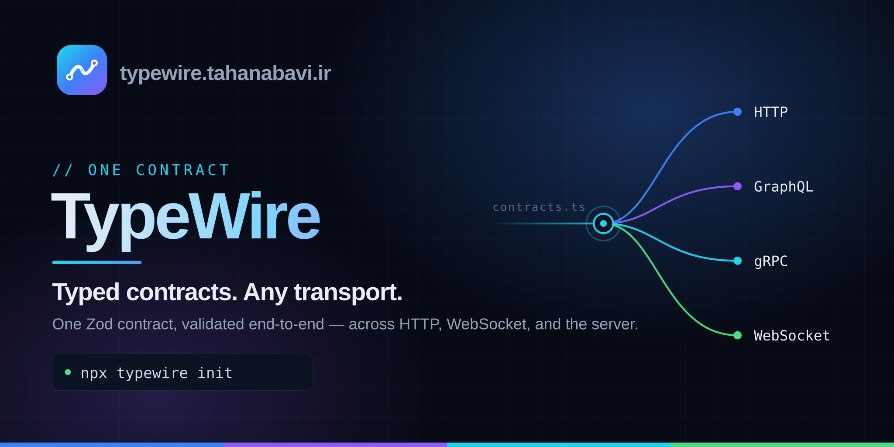

# @typewire/web

The TypeWire website. Next.js (App Router) · React 19 · Tailwind v4.

```bash
pnpm --filter @typewire/web dev          # http://localhost:3000
pnpm --filter @typewire/web build:site   # production build
pnpm --filter @typewire/web registry     # regenerate package data only
```

## Package data is derived, never retyped

Nothing about a package is maintained in this app. `scripts/generate-registry.mjs`
reads the monorepo and writes `src/generated/registry.json` (gitignored) before
every `dev`, `build:site` and `typecheck`:

| Source | What comes from it |
| --- | --- |
| `packages/*/package.json` | name, local version, description, keywords, dependencies, peers, export subpaths |
| `packages/*/README.md` | tagline, feature bullets, install command, banner image (copied into `public/banners/`) |
| `packages/*/docs/releases/*.md` | the release-note history, newest first |
| `size-budget.json` | the gzipped CI ceiling per package |
| `README.md` (repo root) | the roadmap checklist — `- [x]` is shipped, `- [ ]` is next |
| **npm registry** | whether a package is actually published, and at which version |

So publishing a package, editing its README, or ticking a roadmap box updates
this site on its next build. No file here needs touching.

**npm is the authority on "published".** A local version number cannot answer
that question — several packages in this repo carry a non-zero version and one
is further along on npm than in the workspace. When the registry cannot be
reached the generator falls back to the local version, marks the result as
unchecked, and prints a warning; set `TYPEWIRE_OFFLINE=1` to skip the lookup
entirely.

### When derivation gets it wrong

Category and transports are derived from each package's `keywords` and export
subpaths. A package can override that in its own `package.json`, so the
correction still lives with the package:

```jsonc
"typewire": {
  "category": "devtools",
  "transports": ["http", "graphql", "grpc", "ws"],
  "tagline": "…"
}
```

The two devtools packages use this — they are transport-agnostic by design, so
they name no wire in their keywords, yet the site should show all four.

## Live data at request time

`src/features/project-status/` reads GitHub and npm with an hourly
revalidate. Both return `{ data, stale }` instead of throwing, so the dashboard
degrades to last-known values with a `cached` chip rather than a broken grid.
Set `GITHUB_TOKEN` to lift the unauthenticated rate limit.

## Deploying to Vercel

The repo root is a pnpm workspace, so point Vercel at this directory rather than
the repo root:

1. **New Project → import the repo.** Set **Root Directory** to `apps/web`.
   `vercel.json` supplies the build and install commands; leave the framework
   preset on Next.js.
2. **Storage → Upstash (Redis)** from the marketplace. It has a free tier, and
   connecting it injects `UPSTASH_REDIS_REST_URL` and `UPSTASH_REDIS_REST_TOKEN`
   into the project automatically. It rate-limits `/api/ask`; without it the
   site still serves and the limit simply stops counting.
3. **Add the keys you own** — `ANTHROPIC_API_KEY` and, optionally,
   `GITHUB_TOKEN` (see `.env.example`, which explains each one).

There is no database, no cron and no build step beyond the registry: every page
is prerendered from data derived at build time, and the only two things that run
per request are `/api/ask` and the playground's mock handlers.

> Hobby is for non-commercial use. If the site ever becomes commercial, this
> needs a paid plan.

## Why there is no `build` script

`pnpm -r build`, `pnpm -r typecheck` and `pnpm -r test` are the monorepo's
cross-package integrity gates, and they run before every publish. A marketing
site must not be able to block a package release, so this app exposes
`build:site` instead of `build` and has no `test` script — the same convention
`examples/*` follows. It is built by its own workflow,
`.github/workflows/web.yml`, on changes under `apps/web/**`.

`typecheck` *is* exposed, deliberately: it is fast, and a site that no longer
compiles against the packages it documents should show up as a red check.

## Layout

Organised by **feature**, and within every boundary by level. A route is a
shell: metadata, and one view from a feature. A feature owns its view, its
sub-components, its data access, its state and its copy. Only what a second
feature genuinely needs lives in `src/components/`.

```txt
scripts/generate-registry.mjs   the derivation step
src/app/                        routes — metadata + one feature view, nothing else
src/layouts/root-layout/        the <html> shell, its metadata and theme script
src/components/
  ui/<name>/index.tsx             primitives — button, panel, chip, section …
  ui/index.ts                     the primitive barrel
  shared/<name>/                  cross-feature pieces — icons, json-ld
  layouts/<name>/                 site chrome — header, footer, mobile nav, theme
src/features/<name>/
  index.tsx                       the feature's view — what a route renders
  <part>.tsx                      its own sub-components, siblings not folders
  store/index.ts                  its client state, when it has any
  constants.ts                    its own copy and lookup tables
  <name>.ts                       its data access — github.ts, markdown.ts …
src/config/                     site.ts, env.ts
src/routes/paths.ts             every internal path, once
src/lib/                        registry accessor, seo, og, brand, redis
src/utils/                      cn, formatting
src/assets/fonts/               Geist TTFs, for the card renderer only
```

The features:

```txt
home/            hero, what-is, features, cta — and the page that composes them
packages/        the grid, the detail page, cards, filter, architecture diagram
transports/      the wire fan, the transport tabs and their panes
devtools/        the devtools panel preview
docs/            the docs page, the hub, the shell, markdown, the search corpus
ask/             ask-the-docs: the input, the stream, the section around it
feedback/        the feedback form
project-status/  GitHub and npm health — charts, status band, good first issues
roadmap/         the roadmap band, shared by `/` and `/roadmap`
support/         the FAQ and its copy
examples/        the examples listing
playground/      the contract the console and the route handlers both import
```

Three rules keep it that way:

- **A route renders one thing.** If a `page.tsx` grows JSX, that JSX belongs in
  a feature. The route keeps `metadata`, `generateStaticParams` and
  `generateMetadata` — Next resolves those from the route file and nowhere else.
- **A component moves up into `src/components/` only when a second feature needs
  it.** Until then it belongs to the one feature that renders it, however
  reusable it looks. `Panel` and `Chip` are shared; `StatusChip` is not — it
  knows what a published package is, so it lives in `features/packages/`.
- **State is owned by the feature that reads it.** There is no app-wide UI
  store; each feature that needs client state has its own `store/`, so a section
  can be deleted without leaving dead fields behind.

`components/ui/index.ts` re-exports every primitive except `code-block`, which
is an async server component carrying Shiki — import that one by its own path so
a client component never drags the highlighter into the browser bundle.

## Docs

`/docs` renders each package's own markdown, inlined into the generated registry
at build time. Nothing about a package is retyped here — see
[`docs/DOCS.md`](../../docs/DOCS.md) for the manifest shape and the CI gate that
fails a release whose docs were never reviewed against it.

## Playground

`/playground` runs a real `@tahanabavi/typefetch` client in the browser against
route handlers on this site, both built from `src/features/playground/contracts.ts`. Two
switches break it on purpose — a server that answers with the wrong field, and a
request the contract forbids — because a demo that only ever shows green rows
demonstrates nothing.

## SEO

Everything a crawler reads comes from two modules, so nothing is decided twice.

`src/lib/seo.ts` builds a page's `<title>`, description, canonical URL, Open
Graph and Twitter tags from one object — `pageMetadata({ title, description,
path })` — and holds the schema.org builders. It never sets `openGraph.images`:
Next resolves each segment's own `opengraph-image.tsx` into that field, and
naming an image there would override the card the section actually generates.

`src/lib/og.tsx` is that card. One drawing, one accent per section, sized 1200×630
and rendered by `next/og` at build time — 97 of them, all prerendered, none
generated on request. Fonts are read from `src/assets/fonts/` rather than fetched,
so a build with no network still renders the real typeface.

| File | Emits |
| --- | --- |
| `app/robots.ts` | `/robots.txt` — allows everything but `/api` |
| `app/sitemap.ts` | `/sitemap.xml` — enumerated from the registry, package banners included as image entries |
| `app/manifest.ts` | `/manifest.webmanifest` |
| `app/icon.svg`, `app/apple-icon.tsx` | favicon and touch icon, from `src/lib/brand.ts` |
| `app/**/opengraph-image.tsx` | one card per section, plus one per package and per docs page |

Structured data is JSON-LD in an `@graph`. The root layout emits `Organization`,
`WebSite` and `SoftwareApplication` once, with stable `@id`s; each page adds only
what is its own — `TechArticle` for a docs page, `SoftwareSourceCode` for a
package, `CollectionPage` for a listing, `FAQPage` for the home page — and
references the rest by `@id` instead of repeating it.

Two things are worth knowing before editing:

- **A docs page's description is its own first paragraph**, extracted by
  `excerpt()` in `src/features/docs/markdown.ts`. Eighty pages sharing one package summary
  would read as near-duplicates, and Google shows one of those and drops the rest.
- **The site's address is `NEXT_PUBLIC_SITE_URL`**, not a constant. Every
  canonical, `og:url`, sitemap entry and `@id` is built from it, and it is inlined
  at build time — a new domain needs a new build, not a restart. The only place
  the address is written by hand is `public/banner.svg`, which is a static file
  and cannot read the environment.

Set `GOOGLE_SITE_VERIFICATION` and `BING_SITE_VERIFICATION` to add the console
ownership tags; unset, they emit nothing rather than an empty `content=""`.

## Design

Motion tokens live in `globals.css` and scroll entrances use CSS scroll-driven
timelines, so a browser without them renders the finished state rather than
hiding content.

Third-party source: shadcn/ui components (MIT) on Base UI primitives, added with
`shadcn init -b base -p nova`.
