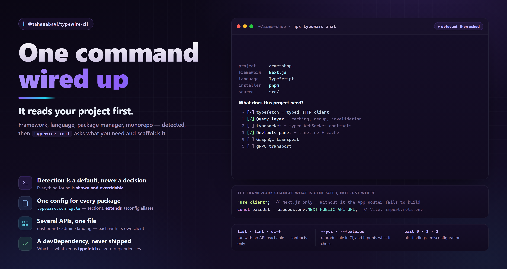

# `@tahanabavi/typewire-cli`



Command-line tools for [TypeFetch](https://www.npmjs.com/package/@tahanabavi/typefetch)
contracts — the contract test runner, scaffolding, and report generation.

```bash
npm i -D @tahanabavi/typewire-cli
npx typewire --help
```

## Why it is a separate package

The CLI binary used to ship inside `@tahanabavi/typefetch`, which meant
every consumer installed `jiti` — a TypeScript loader no browser bundle will
ever need — to get a client library. Moving it out is what lets the core declare
**zero runtime dependencies**.

The split follows the same shape as Prisma (`prisma` / `@prisma/client`) and
Drizzle (`drizzle-kit` / `drizzle-orm`): the thing you ship and the thing you
develop with are different installs.

## Migration

```diff
- import { defineTypeFetchTestConfig } from "@tahanabavi/typefetch";
+ import { defineConfig } from "@tahanabavi/typewire-cli";
```

Add the dev dependency and `npx typewire` works as before. Your existing
`typefetch.test.config.ts` still loads untouched — the CLI lifts its flat shape
into the `typefetch` section and warns once, pointing at the new name. Commands
and flags are unchanged.

## Commands

| Command | Purpose |
| --- | --- |
| `typewire init` | Read the project, ask what it needs, wire it up |
| `typewire test` | Run the contract tests declared on your endpoints (default) |
| `typewire list` | Print every route in the contract, with its transport |
| `typewire release-doc <version>` | Scaffold a release note in `docs/releases` |

### `init`

```bash
npx typewire init
```

It reads the project first — framework, TypeScript, package manager, `src/`,
monorepo, and which `@tahanabavi/*` packages are already installed — then asks
one question: what does this project need?

```txt
  project    acme-shop
  framework  Next.js
  language   TypeScript
  installer  pnpm
  source     src/

What does this project need?
    • [•] typefetch — typed HTTP client
   1  [✓] Query layer — caching, dedup, declared invalidation
   2  [ ] typesocket — typed WebSocket contracts
   3  [✓] Devtools panel — request timeline and cache inspector
   4  [ ] GraphQL transport
   5  [ ] gRPC transport
   ...
```

Everything detected is a **default, shown and overridable** — never a silent
decision. Options that cannot apply are not offered: the devtools panel does not
appear in an Express project, and the NestJS adapter appears only in a NestJS
one.

It then writes a `typewire/` folder wired for what you picked — client,
contracts, query cache, provider, devtools bridge, permissions — prints the
install command for **your** package manager, and lists what to do next. Files
that already exist are skipped unless `--force`.

| Flag | Meaning |
| --- | --- |
| `--yes` | Take every detected default, ask nothing |
| `--features <a,b>` | Skip the question — reproducible in CI |
| `--contracts-path <path>` | Use contracts you already have |
| `--output <dir>` | Scaffold somewhere other than the project root |
| `--dry-run` | Print the plan, write nothing |
| `--force` | Replace existing files instead of skipping them |

The framework changes what is generated, not just where: a Next.js scaffold
marks the provider and devtools `"use client"`, and reads
`process.env.NEXT_PUBLIC_API_URL` where a Vite project reads
`import.meta.env.VITE_API_URL`.

Without a TTY — a CI shell, a piped run — it takes the defaults and **prints
what it chose** rather than blocking on a prompt nobody can answer.

### `test`

```bash
npx typewire test --base-url https://staging.example.com --mode smoke
```

| Flag | Meaning |
| --- | --- |
| `-c, --config <path>` | Config file (default: discovered in cwd) |
| `-m, --mode <mode>` | Test mode |
| `--base-url <url>` | Override the client's base URL |
| `--token <token>` | Auth token |
| `--timeout <ms>` | Per-case timeout |
| `--include-tags` / `--exclude-tags` | Filter by tag |
| `--include-destructive` | Include cases marked `destructive` |
| `--stop-on-fail` | Halt at the first failure |
| `-o, --output <path>` | Report output path |
| `-f, --format <fmt>` | `md`, `html`, or `json` |

`list` prints every route through the transport's own `describe()`, so a gRPC
route shows `gRPC unary user.v1.UserService/GetUser` rather than an empty
method/path — the CLI never reads transport-specific fields directly.

## Config

`typewire.config.ts` in your project root:

```ts
import { defineConfig } from "@tahanabavi/typewire-cli";
import { ApiClient } from "@tahanabavi/typefetch";
import { contracts } from "./src/contracts";

export default defineConfig({
  typefetch: {
    contracts,
    createClient: ({ baseUrl, token }) => {
      const client = new ApiClient({ baseUrl: baseUrl!, token }, contracts);
      client.init();
      return client;
    },
  },
});
```

One section per package, so nothing has to be renamed when a package is added
and a project that only uses typefetch writes only that section. `lint` and
`diff` sit at the top level and a section may override them.

Prefer `createClient` over `client`: it is what lets `--base-url` and `--token`
reach the client, so one config serves local, staging and CI.

### `transports`

```ts
typefetch: {
  contracts,
  transports: [graphqlTransport(), grpcTransport()],
}
```

For the commands that never build a client. `method` and `path` exist only on
http endpoints, so anything printing a route has to ask the adapter — and `list`
has no client to ask. Declaring the adapters here is what lets a gRPC route
print `unary user.v1.UserService/GetUser` instead of `?`, while `list` stays
runnable against an API that is not up. The built-in http adapter is always
present; only add the extras.

**`contracts` is the only always-required key.** A client is required by the
commands that actually make requests, and by nothing else — so `list` (and
later `lint`, `diff`, `explain`) run against a contract file with no API
reachable at all. That is the difference between a check that runs on every
commit and one that never gets wired up.

### Several APIs in one repo

A repo with a dashboard API, an admin API and a landing API declares them as
`projects` — each with its own contracts, client, middleware and base URL:

```ts
export default defineConfig({
  // Shared defaults; a project may override any of them.
  lint: { rules: { "path-params-declared": "error" } },

  projects: {
    dashboard: {
      typefetch: { contracts: dashboardContracts, createClient: createDashboardClient },
    },
    admin: {
      typefetch: { contracts: adminContracts, createClient: createAdminClient },
      lint: { rules: { "duplicate-id": "off" } },   // merged over the shared rules
      diff: { baseline: "admin.lock.json" },        // its own API-surface snapshot
    },
    landing: {
      typefetch: { contracts: landingContracts },   // no client — list/lint only
    },
  },
});
```

One file rather than three, because the alternative is three configs, three
`--config` flags in every script, and three CI steps that drift apart.

```bash
typewire list                              # every project, labelled
typewire test                              # every project; any failure fails the run
typewire test --project admin              # just one
typewire test --project dashboard,admin    # some
```

**Every project runs by default.** A CI gate that quietly checked one of three
API surfaces and reported green would be worse than no gate. Reports go to a
per-project folder for the same reason — sharing one output path means the last
project silently overwrites the others and the report describes one API while
looking complete.

Commands that need exactly one project **refuse to guess**: with several
declared and no `--project`, you get an error naming them rather than a run
against whichever happened to be first.

Omit `projects` entirely for the single-API case — one API should never cost
the ceremony of naming it. Internally it resolves to one implicit project, so
no command branches on which shape you wrote.

### Discovery

Walks up from the working directory, so a package inside a monorepo inherits the
root config without a `--config` flag in every script. `.ts`, `.mts`, `.cts`,
`.js`, `.mjs` and `.cjs` are all supported; TypeScript ones load through `jiti`,
**with your `tsconfig.json` path aliases applied** — a contract file that
imports `@/schemas` resolves the way it does everywhere else in your project.

### `extends`

```ts
export default defineConfig({
  extends: "../../typewire.base.ts",   // or a package name
  typefetch: { contracts },
});
```

Merged key by key, with the extending file winning. Arrays are replaced rather
than concatenated, so a base's `formats: ["markdown", "json", "html"]` can be
narrowed to `["json"]`.

### A config as a function

```ts
export default defineConfig(({ mode, command, ci }) => ({
  typefetch: { contracts },
  diff: { baseline: ci ? "typewire.lock.json" : ".typewire/local.lock.json" },
}));
```

So `--mode` can change the baseline or the report format without a second file.

## Exit codes

| Code | Meaning |
| --- | --- |
| `0` | Success |
| `1` | Findings — tests failed, contracts have problems |
| `2` | Misconfiguration — the config is missing, invalid, or unreadable |

A CI job that gates on findings needs to tell "your contracts have problems"
apart from "your pipeline is broken".

## Exports

| Export | Purpose |
| --- | --- |
| `defineConfig(config)` | Type-safe config helper; accepts an object or a function |
| `defineTypeFetchTestConfig(config)` | Deprecated alias for the pre-2.0 flat shape |
| `loadTypeWireConfig(options)` | Find, merge and validate the config yourself |
| `requireTypeFetch(config, command)` | The `typefetch` section, or an error naming the command |
| `TypeWireConfigError` | Carries `exitCode: 2` |
| `runCli(argv)` | Run the CLI programmatically |
| `writeReportFiles(report, path)` | Write a report as `.md`, `.html` or `.json` |

## License

MIT © [Taha Nabavi](https://www.tahanabavi.ir)
