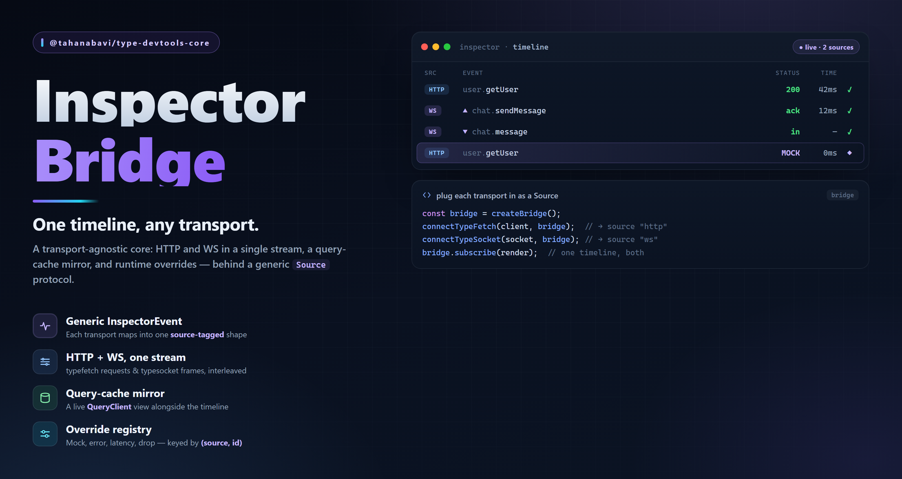

# @tahanabavi/type-devtools-core



The **transport-agnostic** core the TypeWire inspector is built on: one timeline
for HTTP **and** WebSocket, a runtime override registry, and a live mirror of a
query cache. Headless and **dependency-free** — it stores generic events and
types every client structurally, so it imports neither typefetch nor typesocket
nor the query engine.

Pair it with [`@tahanabavi/type-devtools`](../devtools) for the React panel, or
render its snapshots yourself.

```bash
pnpm add @tahanabavi/type-devtools-core
```

## The bridge

`InspectorBridge` is the store: one ring buffer of source-tagged events plus an
override registry keyed by `(source, label)`. Each transport plugs in as a
`connect*` call — that's what lets one timeline hold both without a branch per
transport:

```ts
import {
  InspectorBridge,
  connectTypeFetch,
  connectTypeSocket,
  selectEntries,
} from "@tahanabavi/type-devtools-core";

const bridge = new InspectorBridge();      // { limit } — default 500 events
connectTypeFetch(apiClient, bridge);       // HTTP
connectTypeSocket(socketClient, bridge);   // WebSocket

// A start+success (or outbound+ack) pair collapses into one entry per call.
const entries = selectEntries(bridge.getSnapshot());
```

`bridge.subscribe` / `getSnapshot` implement the `Observable` contract, so a
panel binds it with `useSyncExternalStore` directly.

## Overrides

The override registry steers **every future call** of an endpoint/event — no code
change at the call site, no touching the contract. The connectors translate a
generic override into each transport's own shape (a typefetch `mock`/`error`, a
typesocket `drop`):

```ts
bridge.setOverride("http", "user.getUser", { mock: { id: "1", name: "Forced" } });
bridge.setOverride("http", "user.getUser", { latencyMs: 2000 });
bridge.setOverride("ws", "chat.sendMessage", { drop: true });

bridge.listOverrides();   // render the panel's active-overrides strip
bridge.removeOverride("http", "user.getUser");
```

## Query cache

The timeline is an append-only log; a query cache is a *set of stateful
entities*, so it gets its own store. `connectQueryClient` subscribes to the
engine's event bus, re-reads the authoritative query list, and exposes the three
actions a cache view offers:

```ts
import { connectQueryClient } from "@tahanabavi/type-devtools-core";

const queries = connectQueryClient(queryClient); // a QueryInspector
queries.getSnapshot();          // { queries: [...], mutations: [...] }
queries.refetch(query);         // refetch / invalidate / remove by { endpointId, input }
queries.dispose();              // detach (the timeline connectors return a detach fn instead)
```

The client is typed structurally as `QueryClientLike`, so attaching it adds no
dependency on the query engine.

## Exports

`InspectorBridge` · `selectEntries` · `connectTypeFetch` · `connectTypeSocket` ·
`QueryInspector` · `connectQueryClient`, plus the `InspectorEvent` /
`InspectorEntry` / `InspectorOverride` / `QuerySnapshot` / `QueryInspectorSnapshot`
types.

## License

[MIT](../../LICENSE) © Taha Nabavi
