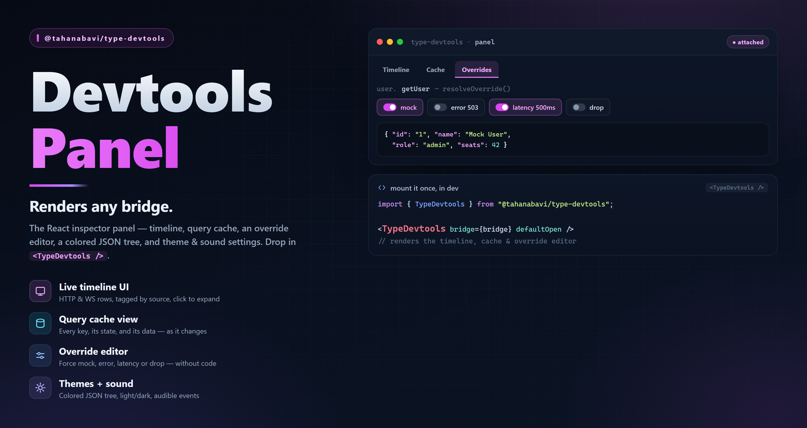

# @tahanabavi/type-devtools



A React inspector panel for the TypeWire ecosystem. One timeline for **HTTP and
WebSocket** traffic, a live **query cache** view, a runtime **override editor**,
and a **settings** tab — dropped into your app as a single component.

It renders any bridge from
[`@tahanabavi/type-devtools-core`](../devtools-core), so adding a transport is
one more `connect*` call, not a change in here.

```bash
pnpm add @tahanabavi/type-devtools @tahanabavi/type-devtools-core
```

## Setup

Wire your clients into a bridge, then render the panel:

```tsx
import {
  InspectorBridge,
  connectTypeFetch,
  connectTypeSocket,
  connectQueryClient,
  TypeDevtools,
} from "@tahanabavi/type-devtools";

const bridge = new InspectorBridge();
connectTypeFetch(apiClient, bridge);   // HTTP
connectTypeSocket(socketClient, bridge); // WebSocket

// Optional: attach a query client to unlock the Cache tab.
const queries = connectQueryClient(queryClient);

function Root() {
  return (
    <>
      <App />
      <TypeDevtools bridge={bridge} queries={queries} />
    </>
  );
}
```

`queries` is optional — omit it and the Cache tab simply doesn't appear.

### Props

| Prop | Type | Default | |
| --- | --- | --- | --- |
| `bridge` | `InspectorBridge` | — | The transport timeline (required). |
| `queries` | `QueryInspector` | — | Attach a query cache to show the Cache tab. |
| `defaultOpen` | `boolean` | `false` | Render expanded on first mount. |
| `title` | `string` | `"TypeWire devtools"` | Header label. |

## What's in it

**Timeline.** One row per call, tagged by source, newest first. Filter by
source (`all` / `http` / `ws`) and status (`pending` / `success` / `error`),
search across labels *and* payloads, and **pause** to freeze the stream while
you read. Select a row for the full input / output / error.

**Override editor.** The override engine was always wired through the bridge and
both connectors — now it's buttons. From a selected row: **force an error**, add
**+1s / +2s latency**, supply a **mock** response (paste JSON), or **drop** a WS
frame. Active overrides show in a strip with per-item and bulk removal. Every
future call of that endpoint/event is steered — no code, no contract change.

**Cache.** Every cached query with its state (`fresh` / `stale` / `fetching` /
`error`), plus one-click **refetch**, **invalidate**, and **remove**, and a
recent-mutations list. Driven entirely by the query client's event bus.

**JSON tree.** Collapsible and syntax-colored, with per-node copy and
search-match highlighting. `Error`, `Map`, `Set`, `Date` and `BigInt` are
normalized; cycles render as `[Circular]` instead of throwing.

**Copy / export.** Copy any entry as JSON, an HTTP entry as **cURL**, or export
the whole timeline to a `.json` file.

**Settings** (persisted to `sessionStorage` for the session):

- **Theme** — `dark` / `light` / `auto` (follows the host's `prefers-color-scheme`).
- **Density** — `comfortable` / `compact`.
- **Animations** — row-enter and a pending pulse, always gated by `prefers-reduced-motion`.
- **Sound** — a soft blip on new traffic, a buzz on error. **Off by default**,
  synthesized with the Web Audio API so no audio asset ships.

## No stylesheet

The panel is dropped into someone else's app, so it ships **no CSS**: every color
is an inline, theme-aware value, and the only injected style is one `@keyframes`
block for the row animations (which inline styles can't express). There are no
runtime dependencies beyond React and `type-devtools-core`.

## Build your own

The panel is one consumer of the primitives, not the only way in. The hooks and
the tree are exported for a custom inspector:

```tsx
import { useInspectorEntries, useQueryInspector, JsonTree } from "@tahanabavi/type-devtools";
```

## License

[MIT](../../LICENSE) © Taha Nabavi
