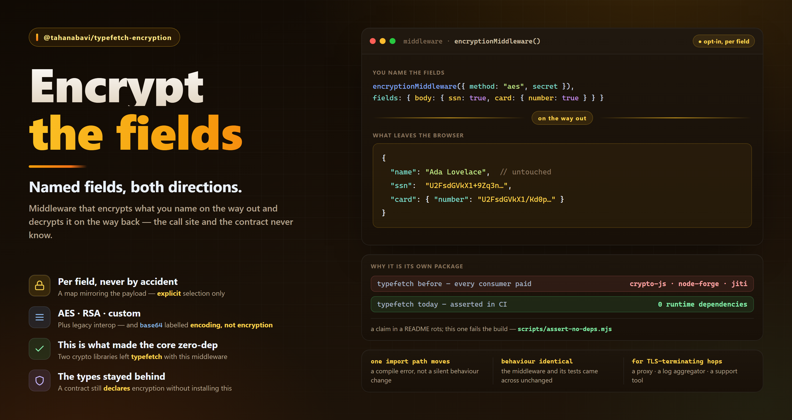

# `@tahanabavi/typefetch-encryption`



Field-level request/response encryption middleware for
[TypeFetch](https://www.npmjs.com/package/@tahanabavi/typefetch) contracts —
AES, DES, RSA, Base64, or your own handlers.

```bash
npm i @tahanabavi/typefetch-encryption
```

## Why it is a separate package

It used to ship inside `@tahanabavi/typefetch`, which meant **every** consumer
installed `crypto-js` and `node-forge` whether or not they encrypted anything.
Moving it out is what lets the core declare **zero runtime dependencies** — the
first thing an enterprise audit checks, and not a claim you can make with two
crypto libraries in the tree.

The contract side did not move. `encryption` is still a key on an endpoint, and
`EncryptionMethod` / `DeepEncryptionMap` / `EncryptionConfig` are still exported
from typefetch core, because they are types with no runtime cost. You can declare
an encrypted endpoint without installing this package; you just cannot execute
one.

## Migration

```diff
- import { encryptionMiddleware } from "@tahanabavi/typefetch";
+ import { encryptionMiddleware } from "@tahanabavi/typefetch-encryption";
```

That is the whole change — the middleware, its options and its behaviour are
byte-for-byte what they were.

## Usage

```ts
import { ApiClient } from '@tahanabavi/typefetch'
import { encryptionMiddleware } from '@tahanabavi/typefetch-encryption'

const client = new ApiClient({ baseUrl: 'https://api.example.com' }, contracts)

client.use(encryptionMiddleware, {
  keyProvider: () => ({ type: 'symmetric', key: process.env.FIELD_KEY! }),
})

client.init()
```

Which fields are encrypted is declared on the endpoint, not at the call site:

```ts
updateUser: {
  method: "PATCH",
  path: "/users/:id",
  request: z.object({ path: z.object({ id: z.string() }), body: Profile }),
  response: Profile,
  encryption: {
    method: "AES",
    request: { body: { ssn: true, phone: true } },
    response: { ssn: true },
  },
}
```

## Options

| Option           | Default | Meaning                                                    |
| ---------------- | ------- | ---------------------------------------------------------- |
| `keyProvider`    | —       | Returns the symmetric key or RSA key pair. Sync or async.  |
| `customHandlers` | —       | Your own `encrypt`/`decrypt` for `method: "Custom"`.       |
| `failClosed`     | `true`  | Throw when encryption fails rather than sending plaintext. |

`failClosed` defaults to `true` on purpose: a middleware that silently falls back
to plaintext when a key is missing is a middleware that will one day ship an SSN
in the clear.

## Methods

| `method`   | Key material     | Notes                                                           |
| ---------- | ---------------- | --------------------------------------------------------------- |
| `"AES"`    | `symmetric`      | Default choice.                                                 |
| `"DES"`    | `symmetric`      | Legacy interop only — do not pick it for new work.              |
| `"RSA"`    | `rsa`            | Public key encrypts, private key decrypts. Small payloads only. |
| `"Base64"` | none             | Encoding, **not** encryption. Obfuscation at best.              |
| `"Custom"` | whatever you use | Requires `customHandlers`.                                      |

`method` can differ per direction: `method: { request: "RSA", response: "AES" }`.

## License

MIT © [Taha Nabavi](https://www.tahanabavi.ir)
