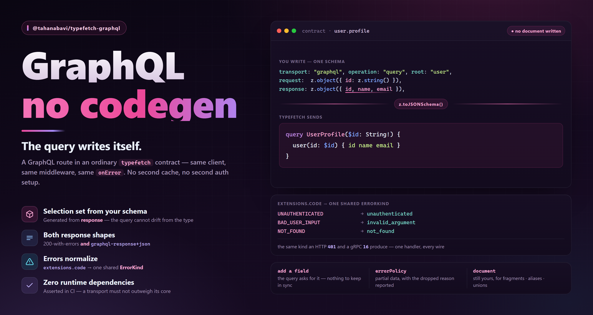

# @tahanabavi/typefetch-graphql



GraphQL as a **transport** for [`@tahanabavi/typefetch`](../typefetch) contracts —
so a GraphQL route lives in the same contract file, behind the same client, as
your REST routes.

```bash
pnpm add @tahanabavi/typefetch-graphql
```

## Why this and not a GraphQL client

**The selection set is generated from your Zod response schema.** No codegen
step, no document to keep in sync, and no way for the shape that requests the
data to drift from the shape that validates it.

```ts
getUser: {
  transport: "graphql",
  operation: "query",
  root: "user",
  request: z.object({ id: z.string() }),
  response: z.object({ id: z.string(), name: z.string() }),
  variableTypes: { id: "ID!" },
}
```

sends

```graphql
query UserGetUser($id: ID!) {
  user(id: $id) {
    id
    name
  }
}
```

Add a field to `response` and it is requested. Remove one and it stops being
requested. Misspell one and it is a type error, not a `null` in production.

And because it is a typefetch transport rather than a second client, everything
else you already configured keeps working unchanged: middleware, `onError`,
retries, timeouts, `AbortSignal`, mock mode, instrumentation, devtools, and the
query engine's cache keys.

## Setup

```ts
import { ApiClient } from '@tahanabavi/typefetch'
import { graphqlTransport } from '@tahanabavi/typefetch-graphql'
import { contracts } from './contracts'

const client = new ApiClient(
  {
    baseUrl: 'https://api.example.com',
    transports: [graphqlTransport({ url: 'https://api.example.com/graphql' })],
  },
  contracts
)

client.init()
```

Installing the package is what makes `transport: "graphql"` compile — it augments
typefetch's `TransportRegistry`. Registering it explicitly is what keeps a
REST-only bundle from paying for it.

## Endpoint fields

| Field           | Required | Meaning                                                                                                                                  |
| --------------- | -------- | ---------------------------------------------------------------------------------------------------------------------------------------- |
| `operation`     | yes      | `"query"` or `"mutation"`                                                                                                                |
| `root`          | —        | The single field to unwrap, so `response` describes `data.user` rather than `data`. Also the field the variables attach to as arguments. |
| `document`      | —        | A hand-written operation. Omit it to have one generated.                                                                                 |
| `operationName` | —        | Defaults to the endpoint id in PascalCase (`user.get` → `UserGet`).                                                                      |
| `variableTypes` | —        | GraphQL types for variables the Zod type cannot name — `{ id: "ID!" }`.                                                                  |
| `errorPolicy`   | —        | `"none"` (default) or `"all"`. See below.                                                                                                |

Everything transport-independent — `auth`, `permission`, `errors`, `mockData`,
`headers`, `test` — works exactly as it does for an HTTP endpoint.

## Variable types

Inferred from the request schema: `z.string()` → `String!`, `z.number().int()` →
`Int!`, `z.number()` → `Float!`, `z.boolean()` → `Boolean!`, `z.array(z.string())`
→ `[String!]!`, and `.optional()` drops the `!`.

Two cases need naming by hand, because nothing in the Zod type could say
otherwise:

- **`ID`** — `z.string()` generates `String!`, which a server expecting `ID!`
  rejects. Write `variableTypes: { id: "ID!" }`.
- **Input objects** — a Zod object cannot name a GraphQL input type. Write
  `variableTypes: { input: "CreateUserInput!" }`.

## What the generator refuses

It fails at `client.init()` — not on a request in production — naming the
endpoint and the path that caused it, and pointing at `document`. Guessing would
produce a query the server rejects at runtime, which is strictly worse.

| Schema                      | Why                                                                             |
| --------------------------- | ------------------------------------------------------------------------------- |
| `z.union([...])` of objects | needs inline fragments (`... on Type`), and the schema does not say which types |
| `z.record(...)`             | GraphQL has no way to ask for "every field"                                     |
| recursive schemas           | a query must be finite; the depth is a decision only you can make               |
| variables with no `root`    | there is no single field to attach the arguments to                             |

Give those endpoints an explicit `document`; everything else about them still
works, including validation against `response`.

## Errors

GraphQL error codes are mapped onto typefetch's shared `ErrorKind`, so **one
global handler covers every transport**:

```ts
client.onError((error) => {
  if (error.kind === 'unauthenticated') redirectToLogin()
})
```

fires for a GraphQL `UNAUTHENTICATED` exactly as it does for an HTTP 401.

| `extensions.code`                                                     | `kind`               |
| --------------------------------------------------------------------- | -------------------- |
| `UNAUTHENTICATED`                                                     | `unauthenticated`    |
| `FORBIDDEN`                                                           | `permission_denied`  |
| `BAD_USER_INPUT`, `GRAPHQL_VALIDATION_FAILED`, `GRAPHQL_PARSE_FAILED` | `invalid_argument`   |
| `NOT_FOUND`                                                           | `not_found`          |
| `TOO_MANY_REQUESTS`                                                   | `resource_exhausted` |
| `INTERNAL_SERVER_ERROR`                                               | `internal`           |
| `SERVICE_UNAVAILABLE`                                                 | `unavailable`        |

Both response media types are handled: the legacy `application/json` (errors
delivered inside a `200`) and `application/graphql-response+json` (errors with a
real 4xx/5xx). `extensions.http.status` is honoured when present.

### Typed error bodies

`errors` is keyed by `extensions.code` for a GraphQL endpoint, and
`isContractError` narrows off it:

```ts
errors: {
  UNAUTHENTICATED: z.object({ code: z.literal("UNAUTHENTICATED"), realm: z.string() }),
}

try {
  await api.user.get({ id });
} catch (e) {
  if (isContractError(contracts.user.get, e, "UNAUTHENTICATED")) {
    e.data.realm; // fully typed
  }
}
```

### Partial data

A response carrying **both** `data` and `errors` is the case every GraphQL client
gets wrong in one direction or the other.

- `errorPolicy: "none"` (default) — throw. A partially-failed response is a
  failed one, and silently returning half a result is how a `null` reaches a UI
  three screens from its cause.
- `errorPolicy: "all"` — resolve the data and hand the errors to
  `onPartialErrors`, so the return type stays `Promise<T>` and nothing is
  dropped.

```ts
graphqlTransport({
  url: '…',
  errorPolicy: 'all',
  onPartialErrors: (errors, { endpointId }) => log.warn(endpointId, errors),
})
```

## Transport options

| Option            | Default              | Meaning                                                                         |
| ----------------- | -------------------- | ------------------------------------------------------------------------------- |
| `url`             | `${baseUrl}/graphql` | the endpoint                                                                    |
| `method`          | `"POST"`             | `"GET"` sends **queries** as `?query=…` (CDN-cacheable). Mutations always POST. |
| `errorPolicy`     | `"none"`             | default for endpoints that do not declare one                                   |
| `onPartialErrors` | —                    | required to see errors under `errorPolicy: "all"`                               |
| `headers`         | —                    | extra headers on every GraphQL request                                          |

## Not supported

Subscriptions (use [`@tahanabavi/typesocket`](../typesocket)), `@defer` /
`@stream`, persisted queries, and file uploads via the multipart spec.

## License

MIT
