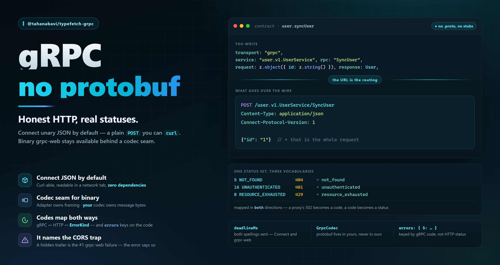

# `@tahanabavi/typefetch-grpc`



gRPC transport for [TypeFetch](https://www.npmjs.com/package/@tahanabavi/typefetch)
contracts. Connect unary JSON out of the box, binary grpc-web behind a codec
seam, **zero dependencies** — no protobuf runtime, no generated code required.

```bash
npm i @tahanabavi/typefetch-grpc
```

Your gRPC routes join the same client, the same middleware chain, the same
`onError`, the same retry policy and the same devtools timeline as your REST
ones. That is the point: application code stops caring which wire it is on.

---

## Setup

```ts
import { ApiClient } from "@tahanabavi/typefetch";
import { grpcTransport } from "@tahanabavi/typefetch-grpc";

const client = new ApiClient(
  {
    baseUrl: "https://api.example.com",
    transports: [grpcTransport({ baseUrl: "https://grpc.example.com" })],
  },
  contracts,
);
client.init();
```

Registration is explicit, so an app that never registers this transport never
ships a byte of it.

## Contracts

```ts
import { z } from "zod";

export const contracts = {
  user: {
    getUser: {
      transport: "grpc",
      service: "user.v1.UserService",
      rpc: "GetUser",
      request: z.object({ id: z.string() }),
      response: z.object({ id: z.string(), name: z.string() }),
      deadlineMs: 5_000,
    },
  },
};
```

`transport: "grpc"` does not compile until this package is installed — the
module augmentation is what adds it to typefetch's registry. Once it is, a gRPC
route is fully checked, including that it may **not** carry `path`, `method`,
`bodyType` or `responseType`. None of those mean anything for a unary RPC.

### Fields

| Field | Required | Meaning |
| --- | --- | --- |
| `service` | yes | Fully-qualified service, `"user.v1.UserService"` |
| `rpc` | yes | Method name, `"GetUser"` |
| `deadlineMs` | no | Server-side deadline (`Connect-Timeout-Ms` / `grpc-timeout`) |
| `codec` | no | Switches this RPC to binary protobuf — see below |

`deadlineMs` is not `RequestOptions.timeout`. The timeout aborts locally; a
deadline asks the **server** to stop working, which is what stops an abandoned
query from holding a database connection. Setting both is normal — make the
local timeout the more generous one.

## The wire

Connect's unary JSON protocol is the default because it is the only
gRPC-family protocol that is honest HTTP — real status codes, a JSON error body,
no trailers, and reproducible with curl:

```txt
POST /user.v1.UserService/GetUser
Content-Type: application/json
Connect-Protocol-Version: 1
Connect-Timeout-Ms: 5000

{"id":"u_1"}
```

Your Zod schemas stay the source of truth. No `.proto` is parsed at runtime and
no protobuf runtime is installed.

> Already running **grpc-gateway** with transcoded REST paths? You need no
> adapter at all — that is the built-in `http` transport.

## Errors

Failures normalise onto typefetch's shared `ErrorKind`, so one global handler
covers every transport:

```ts
client.onError((error) => {
  if (error.kind === "unauthenticated") redirectToLogin();
});
```

That fires for a gRPC `UNAUTHENTICATED` exactly as it does for an HTTP 401 and a
GraphQL `UNAUTHENTICATED`.

The **typed** error body stays gRPC-native: a gRPC endpoint's `errors` map is
keyed by the **numeric gRPC code**, not the HTTP status.

```ts
import { GrpcCode } from "@tahanabavi/typefetch-grpc";

getUser: {
  transport: "grpc",
  service: "user.v1.UserService",
  rpc: "GetUser",
  request: z.object({ id: z.string() }),
  response: User,
  errors: {
    [GrpcCode.NotFound]: z.object({ code: z.string(), message: z.string() }),
  },
}
```

```ts
if (isContractError(contracts.user.getUser, e, GrpcCode.NotFound)) {
  e.data.message; // typed from the schema above
}
```

Keying on the code rather than the status is what makes a contract's declared
errors mean the same thing over Connect (which maps codes onto real statuses) and
over binary grpc-web (which answers `200` and reports the code in a trailer).
`RichError.grpcCode` carries the numeric code; `RichError.status` stays the HTTP
status.

## Binary grpc-web

Reach for this only when you need protobuf on the wire. Connect JSON is
debuggable in a way binary frames never are.

```ts
import { grpcTransport } from "@tahanabavi/typefetch-grpc";
import { GetUserRequest, GetUserResponse } from "./gen/user_pb";

grpcTransport({
  codec: {
    encode: (message) => GetUserRequest.toBinary(message),
    decode: (bytes) => GetUserResponse.fromBinary(bytes),
  },
});
```

The codec deals only in **message bytes**. This package owns the 5-byte
length-prefix framing, the `0x80` trailer frame, percent-decoding of
`grpc-message`, and trailers-only responses — protocol concerns, not schema
ones. That boundary is what keeps protobuf out of everything published here.

Set a codec per endpoint to mix binary and JSON RPCs on one client.

### The failure everyone hits first

A browser calling a cross-origin grpc-web server needs the server to expose the
trailer:

```txt
Access-Control-Expose-Headers: grpc-status, grpc-message
```

Without it the trailer is invisible to the client even though it was sent, and
every call fails. This transport detects that exact case and says so in the
error message rather than reporting a generic parse failure.

Binary grpc-web also generally needs a proxy (Envoy, or a server with grpc-web
support built in) in front of a plain gRPC server. `grpc-web-text` (base64) is
not supported.

## Capabilities

`onUploadProgress` and `onDownloadProgress` do nothing here — a unary RPC is one
message in and one message out. The client warns rather than silently never
calling your handler, because a progress bar frozen at zero reads as a hung app.

Streaming (server, client, bidi) is deliberately out of scope: it cannot return
`Promise<T>`, so it would change the shape of every generated method. Use
`@tahanabavi/typesocket` for streams.

## Exports

| Export | Purpose |
| --- | --- |
| `grpcTransport(config?)` | The adapter |
| `GrpcCode` | Numeric code enum — use it as your `errors` keys |
| `codeName` / `parseCode` | Code ↔ Connect wire name |
| `kindFromGrpcCode` | Code → shared `ErrorKind` |
| `statusFromGrpcCode` / `codeFromHttpStatus` | Code ↔ HTTP status |
| `encodeFrame` / `decodeFrames` / `parseTrailer` | grpc-web framing primitives |
| `GrpcCodec` | The binary codec interface |

## License

MIT © [Taha Nabavi](https://www.tahanabavi.ir)
