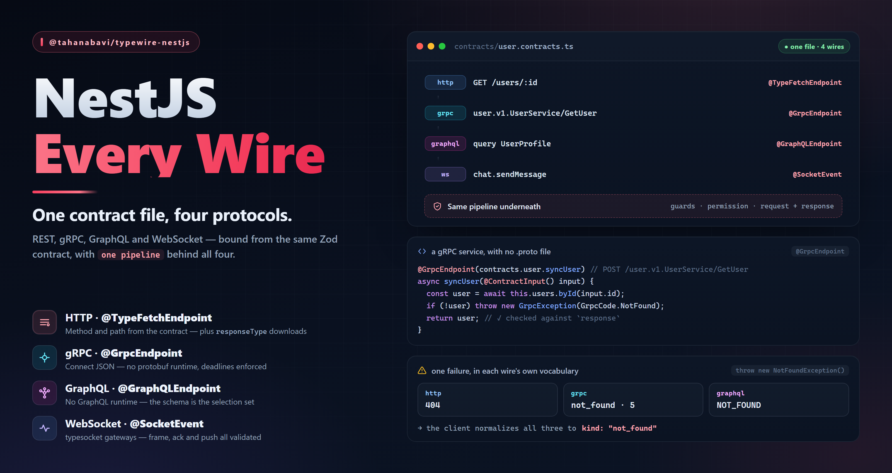

# @tahanabavi/typewire-nestjs



NestJS integration for the [TypeWire](https://github.com/TahaNabavi/typewire) ecosystem — bind handlers and validate **request input** and **response output** on the backend using the **exact same Zod contracts** your frontend consumes, over **every wire the client speaks**: REST/HTTP, gRPC (Connect JSON), GraphQL, and typesocket WebSocket gateways.

One contract file. The client validates on the way out; typewire-nestjs validates on the way in — and guarantees your handlers return exactly what the contract promises, whichever protocol carried it.

```
        frontend                      shared contract                     backend
┌──────────────────────┐        ┌─────────────────────────┐        ┌──────────────────────┐
│  ApiClient(contracts)│ ─────▶ │ { transport?,           │ ◀───── │ @TypeFetchEndpoint(  │
│  api.user.getUser()  │        │   request:  z.object,   │        │   contracts.user.    │
│  ✓ input validated   │        │   response: z.object }  │        │   getUser)           │
│  ✓ output validated  │        └─────────────────────────┘        │  ✓ route from path   │
└──────────────────────┘                 one file                  │  ✓ input validated   │
                                            │                      │  ✓ output validated  │
        ┌───────────────────────────────────┼───────────────────────────────────┐
        ▼                  ▼                ▼                 ▼                 ▼
  @TypeFetchEndpoint  @GrpcEndpoint   @GraphQLEndpoint   @SocketEvent      one pipeline
   http · REST        grpc · Connect   graphql            ws · typesocket   guards, validation,
                                                                            permission
```

## Installation

```bash
npm install @tahanabavi/typewire-nestjs @tahanabavi/typefetch zod
```

Peer dependencies: `@nestjs/common` + `@nestjs/core` (v10 or v11), `rxjs`, `reflect-metadata`, `zod@^4`.

Every non-HTTP wire ships behind its own entry point, so an HTTP-only app installs nothing extra. Each one's peer is a package the contract already needed — see [Every wire the client speaks](#every-wire-the-client-speaks):

| Entry point                           | Optional peer                                   |
| ------------------------------------- | ----------------------------------------------- |
| `@tahanabavi/typewire-nestjs/grpc`    | `@tahanabavi/typefetch-grpc`                    |
| `@tahanabavi/typewire-nestjs/graphql` | `@tahanabavi/typefetch-graphql`                 |
| `@tahanabavi/typewire-nestjs/socket`  | `@nestjs/websockets` + `@tahanabavi/typesocket` |

## Quick start

**The shared contract** (imported by both frontend and backend):

```ts
// contracts/user.contracts.ts
import { z } from 'zod'
import type { Contracts } from '@tahanabavi/typefetch'

export const contracts = {
  user: {
    getUser: {
      method: 'GET',
      path: '/users/:id',
      request: z.object({
        path: z.object({ id: z.string() }),
        query: z.object({ verbose: z.boolean().optional() }).optional(),
      }),
      response: z.object({ id: z.string(), name: z.string() }),
    },
    createUser: {
      method: 'POST',
      path: '/users',
      auth: true,
      request: z.object({
        body: z.object({ name: z.string().min(2), age: z.number().int() }),
      }),
      response: z.object({ id: z.string(), name: z.string() }),
    },
  },
} as const satisfies Contracts
```

**The controller:**

```ts
import { Controller } from '@nestjs/common'
import {
  TypeFetchEndpoint,
  ContractInput,
  InferRequest,
  InferResponse,
} from '@tahanabavi/typewire-nestjs'
import { contracts } from './contracts/user.contracts'

type GetUser = typeof contracts.user.getUser
type CreateUser = typeof contracts.user.createUser

@Controller()
export class UserController {
  // GET /users/:id — method + path come from the contract. No @Get, no drift.
  @TypeFetchEndpoint(contracts.user.getUser)
  async getUser(
    @ContractInput() input: InferRequest<GetUser>
  ): Promise<InferResponse<GetUser>> {
    return { id: input.path.id, name: 'Taha' }
  }

  @TypeFetchEndpoint(contracts.user.createUser, { httpCode: 200 })
  async createUser(
    @ContractInput() input: InferRequest<CreateUser>
  ): Promise<InferResponse<CreateUser>> {
    return { id: 'u-1', name: input.body.name }
  }
}
```

That's it. For every bound endpoint:

- **Route** — HTTP method and path are taken from the contract (`/users/:id` is the same param syntax NestJS uses). Use a prefix-less `@Controller()`, since contract paths are absolute.
- **Request validation** — `params`, `query`, `body`, and declared `headers` are validated against `endpoint.request`. Failures return a `400` whose body the typefetch client surfaces as a first-class `RichError` (see below).
- **Response validation** — the handler's return value is validated against `endpoint.response` **and stripped** of undeclared fields, so entities never leak extra data. A mismatch logs the issues and returns `500` — backend drift from the contract can't ship silently.

## Every wire the client speaks

typefetch v2 made the transport pluggable: one client, one contract file, and
`transport: "grpc"` or `transport: "graphql"` on the endpoints that need it.
This package serves all of them, plus typesocket gateways.

Each wire is bound by its own decorator from its own entry point — the mirror of
the client, where an adapter is _registered_ at the setup site rather than
discovered. If the server could silently serve a transport the client never
registered, the two halves of one contract could disagree about which wire they
are on.

| The contract declares           | Bind it with           | Import from                   | Also install                    |
| ------------------------------- | ---------------------- | ----------------------------- | ------------------------------- |
| nothing, or `transport: "http"` | `@TypeFetchEndpoint()` | `@tahanabavi/typewire-nestjs` | —                               |
| `transport: "grpc"`             | `@GrpcEndpoint()`      | `…/typewire-nestjs/grpc`      | `@tahanabavi/typefetch-grpc`    |
| `transport: "graphql"`          | `@GraphQLEndpoint()`   | `…/typewire-nestjs/graphql`   | `@tahanabavi/typefetch-graphql` |
| a typesocket event              | `@SocketEvent()`       | `…/typewire-nestjs/socket`    | `@nestjs/websockets`            |

Every peer above is one you already have: `@tahanabavi/typefetch-grpc` is what
augments typefetch's `TransportRegistry` with `transport: "grpc"`, so without it
the contract could not have been written.

Passing a contract to the wrong decorator throws **while the module is loading**,
naming the one that serves it:

```txt
[typewire-nestjs] @TypeFetchEndpoint() serves "http" endpoints, but
user.v1.UserService/GetUser is declared for "grpc". Bind it with
`@GrpcEndpoint()` from "@tahanabavi/typewire-nestjs/grpc" instead.
```

Everything below the transport is shared. Guards (including the permission
guard), interceptors, request validation against `request` and response
validation against `response` work identically on all four — only the wire
differs, which is the whole claim of the transport seam.

## gRPC — Connect JSON, no protobuf

`@tahanabavi/typefetch-grpc` speaks **Connect's JSON protocol** by default: a
plain `POST /<service>/<rpc>` with the message as the body, real HTTP status
codes, curl-able. That is an HTTP route, so NestJS can serve it — with no
protobuf runtime, no `.proto` file and no code generation anywhere.

```ts
import { Controller } from '@nestjs/common'
import { ContractInput, InferRequest } from '@tahanabavi/typewire-nestjs'
import {
  GrpcEndpoint,
  GrpcException,
  GrpcCode,
} from '@tahanabavi/typewire-nestjs/grpc'

@Controller() // prefix-less: the service name
export class UserRpcController {
  // fully qualifies the route
  @GrpcEndpoint(contracts.user.getUser) // POST /user.v1.UserService/GetUser
  async getUser(
    @ContractInput() input: InferRequest<typeof contracts.user.getUser>
  ) {
    const user = await this.users.byId(input.id)
    if (!user) throw new GrpcException(GrpcCode.NotFound, `No user ${input.id}`)
    return user // validated against `response`
  }
}
```

**Failures are named in gRPC's key space**, which is what a gRPC endpoint's
`errors` map is keyed by. Throw a `GrpcException` to say exactly which code, or
throw the NestJS exception you already would and let it map:

| Handler throws                               | Code                | HTTP |
| -------------------------------------------- | ------------------- | ---- |
| `GrpcException(GrpcCode.NotFound)`           | `not_found`         | 404  |
| `BadRequestException` / a contract violation | `invalid_argument`  | 400  |
| `UnauthorizedException`                      | `unauthenticated`   | 401  |
| `ForbiddenException`                         | `permission_denied` | 403  |
| `NotFoundException`                          | `not_found`         | 404  |
| `ConflictException`                          | `already_exists`    | 409  |
| anything else                                | `internal`          | 500  |

That table is deliberately _not_ the client's `codeFromHttpStatus`. There, a 404
came from something that never reached the RPC, so it means "no such method" —
`unimplemented`. Here it came from a handler that looked and did not find, which
is `not_found`. Same status, opposite meaning, because the thrower is different.

**Deadlines are enforced, not just received.** The client sends the contract's
`deadlineMs` as `Connect-Timeout-Ms` (and `grpc-timeout`); a deadline only the
client honours is a timeout — the caller gives up and the server keeps the
database connection. `@GrpcDeadline()` hands the handler an `AbortSignal` so the
work can stop too:

```ts
@GrpcEndpoint(contracts.report.build)
build(@ContractInput() input, @GrpcDeadline() deadline?: GrpcDeadlineInfo) {
  return this.db.query(sql, { signal: deadline?.signal });
}
```

When the deadline passes, the RPC answers `deadline_exceeded` / `504`.

Two details that are easy to get wrong and are handled: a unary call answers
**200**, not Nest's default 201 for a POST; and the global response envelope is
never applied — a Connect client reading `{ success: false, message }` sees no
`code` at all and classifies every failure as `unknown`.

**Not served: binary grpc-web.** An endpoint with a `codec` sends
`application/grpc-web+proto`, which needs raw-body access and length-prefixed
trailer framing on the way out. `@GrpcEndpoint()` refuses it at bootstrap rather
than answering JSON to a protobuf client. Put a grpc-web proxy in front, or drop
`codec` and use JSON on both ends.

## GraphQL — no GraphQL runtime

`@tahanabavi/typefetch-graphql` generates its operation document **from the
endpoint's Zod `response` schema**. Both halves of the contract therefore agree
on the selection set by construction — which means an operation can be addressed
by name and answered from the same schema that asked for it. No `graphql`
package, no SDL file, no resolver map.

```ts
import { Module, Injectable } from '@nestjs/common'
import { ContractInput, InferRequest } from '@tahanabavi/typewire-nestjs'
import {
  ContractGraphQLModule,
  GraphQLEndpoint,
} from '@tahanabavi/typewire-nestjs/graphql'

@Injectable()
export class UserResolver {
  @GraphQLEndpoint(contracts.user.profile) // transport: "graphql"
  profile(@ContractInput() input: InferRequest<typeof contracts.user.profile>) {
    return this.users.byId(input.id) // → { data: { user: { … } } }
  }
}

@Module({
  imports: [ContractGraphQLModule.forRoot({ contracts })],
  providers: [UserResolver],
})
export class AppModule {}
```

A resolver is an ordinary NestJS provider. It declares no route — every
operation arrives at one endpoint (`/graphql` by default) which dispatches on
the operation name — and it is discovered at bootstrap, so nothing is listed
twice.

`contracts` is required, and not merely convenient: a GraphQL operation is
addressed by **name**, and the name the client sends is derived from the
endpoint's `"module.endpoint"` id (`user.profile` → `UserProfile`). An endpoint
object on its own does not know its own id, so the only way to reconstruct that
name is to look the object up in the map it came from.

What you get:

- **The result is nested under `root`** when the contract declares one, and sits
  directly under `data` when it does not — matching what the generated document
  selected.
- **Guards and interceptors run.** The resolver goes through NestJS's own
  pipeline, so `@UseGuards(PermissionGuard)` enforces the contract's
  `permission` key in a resolver exactly as it does on a route.
- **`@ContractInput()` returns the validated variables**, the same decorator an
  HTTP handler uses.
- **Failures are named in GraphQL's key space** — `extensions.code`, which is
  what a GraphQL endpoint's `errors` map is keyed by. `NotFoundException` →
  `NOT_FOUND`, a contract violation → `BAD_USER_INPUT`, `ForbiddenException` →
  `FORBIDDEN`; or throw `GraphqlException(code, message)` to say it outright.
- **Media type negotiation.** A client that accepts
  `application/graphql-response+json` gets the real HTTP status on a failure; one
  that accepts only `application/json` gets the spec's `200` with the intended
  status in `extensions.http.status`, which is what typefetch reads.
- **`GET` for queries** (`?query=&variables=`), so a query can be CDN-cached.
  Mutations are refused over GET — a mutation a cache can replay is a way to lose
  a write.

### A contract server, not a GraphQL server

The trade is worth stating plainly. **The document is not executed.** The
operation is resolved by name and the response is the endpoint's `response`
schema — which is exactly what the client's generated selection set asked for.

That is correct for any client generated from the same contract, and it is _not_
a general GraphQL server: there is no introspection, no schema stitching, no
field-level resolvers, no aliases and no fragments. A hand-written query
selecting a subset gets the full contract shape back (harmless — the client's
schema strips it); one using an alias will not resolve. If you need any of that,
`@nestjs/graphql` is the right tool and this does not try to replace it.

## WebSocket gateways (typesocket)

One contract object serves both ends. typesocket events declare their own
`direction`, so the client emits `client->server` and listens to
`server->client` — and a gateway does exactly the reverse, from the same file,
with no mirrored second declaration to drift.

```ts
import { WebSocketGateway, WebSocketServer } from '@nestjs/websockets'
import {
  SocketEvent,
  SocketPayload,
  bindSocketContracts,
  createSocketEmitter,
  type InferSocketRequest,
} from '@tahanabavi/typewire-nestjs/socket'
import { wsContracts } from './contracts/chat.contracts'

export const events = bindSocketContracts(wsContracts)

@WebSocketGateway()
export class ChatGateway {
  @WebSocketServer() server!: Server
  private readonly emit = createSocketEmitter(() => this.server)

  @SocketEvent(events.chat.sendMessage) // wire name from the contract
  async send(
    @SocketPayload() input: InferSocketRequest<typeof events.chat.sendMessage>
  ) {
    const message = await this.chat.post(input.text)
    this.emit(events.chat.message, message) // validated against `payload`
    return { id: message.id } // validated against `ack`
  }
}
```

`bindSocketContracts()` exists because a definition object does not know its own
name: the wire event name defaults to `"module.event"`, which is a fact about
where it sits in the map. Binding resolves it once, the same way the client
does, and refuses two events that collide on one wire name — where a single
frame would reach both handlers and both would try to acknowledge it.

Three checks, one per direction that can break:

| Checked         | Against   | Why it matters                                                                                                                   |
| --------------- | --------- | -------------------------------------------------------------------------------------------------------------------------------- |
| inbound frame   | `request` | via `@SocketPayload()` — nothing else validates what a sender put on the wire                                                    |
| acknowledgement | `ack`     | typesocket **validates the ack on arrival**, so a drifted one rejects far from the server that sent it                           |
| server push     | `payload` | typesocket **drops** an inbound payload that fails its schema — a renamed field turns into a listener that silently stops firing |

`createSocketPermissionGuard()` enforces a `client->server` event's contract
`permission` server-side. typesocket ships a client-side equivalent and says of
it that the check is UX only — this is the real enforcement point:

```ts
export const SocketPermissionGuard = createSocketPermissionGuard({
  getPermissions: (client) => client.data.perms as bigint,
  authorize: P.authorize,
})

@WebSocketGateway()
@UseGuards(SocketPermissionGuard)
export class ChatGateway {
  /* … */
}
```

**On failures.** A rejected frame throws `SocketContractException`, which NestJS
sends as socket.io's standard `exception` event; the frame is not acknowledged.
An ack is not an error channel — typesocket validates it against `ack`, so an
error object sent there would arrive as a _malformed ack_ rather than as the
rejection it is. An event whose failures the caller must handle should say so in
its contract: `ack: z.discriminatedUnion("ok", [ … ])`, the same rule that
governs `errors` on an HTTP endpoint.

## Non-JSON responses (`responseType`)

An HTTP contract can declare how its success body is decoded — `"text"`,
`"blob"`, `"arrayBuffer"`, `"formData"`, `"file"`, `"stream"` or `"response"`.
Two things follow on the server, and both are handled:

**Bytes are sent as bytes.** A `Buffer` returned from a NestJS handler is
JSON-serialised into `{"type":"Buffer","data":[37,80,…]}`. Return
`contractFile()` (or a bare `Buffer`/`Readable`) and it is streamed instead:

```ts
import { contractFile } from "@tahanabavi/typewire-nestjs";

@TypeFetchEndpoint(contracts.report.download)   // responseType: "file"
download() {
  return contractFile(await this.render(), {
    filename: "Q3 résumé.pdf",
    contentType: "application/pdf",
  });
}
```

`Content-Disposition` is sent in both RFC 6266 spellings, so a non-ASCII name
survives and the ASCII fallback cannot inject a header parameter of its own.
`Content-Length` is sent whenever it is known — it is what makes the client's
download progress report a percentage instead of an indeterminate spinner.

**The response schema is not enforced for those types**, because it cannot be:
`zBlob()` matches a browser `Blob` and `zFile()` a `{ blob, filename, … }` —
values that only exist after the _client_ decodes the body. Returning the wrong
kind of thing is caught instead, with a message that names the fix:

```txt
Endpoint declares responseType: "file" but the handler returned a plain Object.
Return a Buffer, a Readable, or contractFile(body, { filename, contentType }).
```

`"json"` and `"text"` are still validated normally, and `"text"` is sent as
`text/plain` rather than Express's default `text/html`.

### `fetch` and `xhr`

The contract's `driver` (`"auto"` / `"fetch"` / `"xhr"`) is a client-side
choice: both produce the same HTTP request, and there is nothing for a server to
do differently. What the server _does_ owe them is the two headers a browser
hides cross-origin — without which a download loses its filename and a progress
bar can never fill:

```ts
import { CONTRACT_EXPOSED_HEADERS } from '@tahanabavi/typewire-nestjs'

app.enableCors({ exposedHeaders: [...CONTRACT_EXPOSED_HEADERS] })
```

They are set on the response automatically; CORS is the only place they can be
_granted_.

## `@SkipEnvelope()`

The response envelope is app-wide, which is right for an API whose client reads
one wrapper shape — and wrong for anything whose body shape is fixed by someone
else: a health check a load balancer parses, a webhook receipt, an OAuth
callback.

```ts
@Get("/healthz")
@SkipEnvelope()
health() {
  return { status: "ok" };
}
```

It exempts the success wrapper _and_ the error branch, so a failing exempt route
answers with its own shape too. gRPC routes and the GraphQL endpoint carry it
automatically: each brings an envelope of its own.

## Retrofitting existing routes: `@UseContract`

Keep your own route decorators and add only validation:

```ts
@Controller("users")
export class UserController {
  @Get(":id")
  @UseContract(contracts.user.getUser)
  getUser(@ContractPath() path: InferRequest<GetUser>["path"]) { ... }
}
```

## Param decorators

| Decorator            | Returns                                                                                                                         |
| -------------------- | ------------------------------------------------------------------------------------------------------------------------------- |
| `@ContractInput()`   | The whole validated input, shaped like the contract's `request` schema — exactly what the frontend passed to the client method. |
| `@ContractPath()`    | Validated (and coerced) path params.                                                                                            |
| `@ContractQuery()`   | Validated (and coerced) query params.                                                                                           |
| `@ContractBody()`    | Validated body (the whole input for flat contracts).                                                                            |
| `@ContractHeaders()` | Validated headers part.                                                                                                         |

Native `@Param()`, `@Query()`, and `@Body()` also see the validated, coerced values — the interceptor mirrors them back onto the platform request.

## Wire-type coercion

HTTP turns everything in a URL into strings. The typefetch client serializes query/path values with `URLSearchParams` (`true` → `"true"`, arrays → repeated keys, `Date` → ISO string, nested objects → JSON). typewire-nestjs reverses that **against the contract schema** before validating, so contracts written for the client work unchanged on the server:

| Contract declares              | Wire value                   | Handler receives      |
| ------------------------------ | ---------------------------- | --------------------- |
| `z.number()`                   | `"25"`                       | `25`                  |
| `z.boolean()`                  | `"true"`                     | `true`                |
| `z.date()` (query **or** body) | `"2026-01-01T00:00:00.000Z"` | `Date`                |
| `z.array(z.string())`          | `?tags=a&tags=b` / `?tags=a` | `["a","b"]` / `["a"]` |
| `z.object({...})` in query     | `'{"a":1}'` (JSON string)    | `{ a: 1 }`            |
| `z.bigint()` in query          | `"9007199254740993"`         | `9007199254740993n`   |

Coercion never invents data — if a value can't be coerced it is passed through untouched and Zod reports the real error. Disable with `coerce: false` (per endpoint or globally).

## Error shapes (RichError-compatible)

Request validation failure → `400` with **all** part issues collected:

```json
{
  "statusCode": 400,
  "message": "Request validation failed",
  "code": "VALIDATION_ERROR",
  "errors": {
    "path.id": ["Too small: expected string to have >=1 characters"],
    "body.name": ["Too small: expected string to have >=2 characters"]
  }
}
```

On the frontend, `RichError` picks up `message`, `code`, and `errors` automatically — field errors from the backend arrive typed and addressable.

Response contract violation → `500` with `code: "RESPONSE_CONTRACT_VIOLATION"`. Issues are always logged server-side; include them in the body during development with `exposeResponseErrors: true`.

## Global configuration

The decorators work with zero setup. Import the module to change defaults app-wide:

```ts
@Module({
  imports: [
    TypeFetchModule.forRoot({
      validateRequest: true, // default
      validateResponse: true, // default
      coerce: true, // default
      exposeResponseErrors: process.env.NODE_ENV !== 'production',
    }),
  ],
})
export class AppModule {}
```

Every option can also be overridden per endpoint: `@TypeFetchEndpoint(endpoint, { validateResponse: false })`.

## Honoring the contract's `auth` flag

The bound endpoint is available to guards via `getContractEndpoint()`:

```ts
import { getContractEndpoint } from '@tahanabavi/typewire-nestjs'

@Injectable()
export class ContractAuthGuard implements CanActivate {
  canActivate(context: ExecutionContext): boolean {
    const endpoint = getContractEndpoint(context)
    if (!endpoint?.auth) return true // public per contract
    return this.validateBearerToken(context) // your auth logic
  }
}

// app.module.ts
providers: [{ provide: APP_GUARD, useClass: ContractAuthGuard }]
```

## Permission guard _(v0.2.0)_

Where `auth` answers _"is there a token?"_, the **permission guard** answers _"is
this actor allowed?"_ — enforcing the optional [`permission`
key](../typefetch#permissions) an endpoint declares on its contract, using the
**same** [`@tahanabavi/type-permission`](../permission) bit map the frontend
checks. The route can't drift from the button.

`createPermissionGuard` builds the guard from two functions you provide — where to
read the actor's bits, and how to evaluate a requirement (pass your permission
instance's `P.authorize` straight through):

```ts
import { APP_GUARD } from '@nestjs/core'
import { createPermissionGuard } from '@tahanabavi/typewire-nestjs'
import { P } from './permissions' // your definePermissions() bit map

export const PermissionGuard = createPermissionGuard({
  // whatever your auth layer put on the request (decoded JWT, session lookup…)
  getPermissions: (req) => req.user.perms as bigint,
  authorize: P.authorize,
  // audit-log seam — denials are a security signal
  onDeny: ({ decision, context }) =>
    logger.warn('permission denied', { missing: decision.missing }),
})

// app.module.ts — enforce everywhere
@Module({ providers: [{ provide: APP_GUARD, useClass: PermissionGuard }] })
export class AppModule {}
```

With `@TypeFetchEndpoint(contracts.message.remove)`, the guard reads
`endpoint.permission` automatically — no extra decorator to forget. A route with
**no** requirement (no contract `permission`, no `@RequirePermission`) always
passes: enforcement is purely additive.

On a denial it throws a `ForbiddenException` whose body names the missing flags:

```jsonc
{
  "statusCode": 403,
  "code": "FORBIDDEN",
  "message": "Insufficient permissions",
  "missing": ["chat.MANAGE_MESSAGES"],
}
```

Customize the thrown error with `onForbidden`. Both `getPermissions` and
`authorize` may be async.

### `@RequirePermission()` — routes without a contract

For a route that isn't bound to a contract (or to **override** a contract's
`permission`), declare the requirement inline. Handler metadata wins over the
class, and `@RequirePermission` wins over the contract's `permission`:

```ts
@Post("ban")
@RequirePermission({ require: ["guild.KICK_MEMBERS"] })
banUser() { /* ... */ }

// any-of: at least one flag
@RequirePermission({ any: ["post.publish", "post.moderate"] })
publish() { /* ... */ }
```

The guard depends only on typefetch — `PermissionDecisionLike` is declared
structurally, so passing `type-permission`'s `P.authorize` needs no adapter. See
[`docs/releases/v0.2.0.md`](./docs/releases/v0.2.0.md).

## Flat (non-structured) contracts

A request schema that isn't shaped as `{ path, query, body, headers }` is "flat" — the client sends the whole input as the JSON body, and the server validates `req.body` against the whole schema. Both styles work with both decorators.

## Response envelope (mirror of `setResponseWrapper`)

The typefetch client can wrap every response in an envelope via `client.setResponseWrapper()`:

```ts
client.setResponseWrapper((successResponse) =>
  z.union([
    z.object({ success: z.literal(true), data: successResponse }),
    z.object({ success: z.literal(false), message: z.string() }),
  ])
)
```

Enable the **matching** server side so the client's wrapper parses both branches:

```ts
TypeFetchModule.forRoot({ envelope: true })
```

- **Successful responses** are wrapped in `{ success: true, data }` — _after_ contract-response validation (the envelope interceptor is global, so it runs outside the method-scoped validator).
- **Every error** — contract 400s, response-violation 500s, and any other `HttpException` — is formatted by a catch-all filter into `{ success: false, message, code?, errors? }`, keeping the original HTTP status. This matters: with a client wrapper active, an unwrapped error body would fail the client's schema parse, so the envelope must cover failures too.
- It applies to **all** routes (contract-bound or not), so the whole API has one shape.

Customize the shape (must match your client wrapper) or return errors as `200`:

```ts
TypeFetchModule.forRoot({
  envelope: {
    success: (data) => ({ ok: true, result: data }),
    error: (e) => ({ ok: false, reason: e.message, code: e.code }),
    errorStatus: 200, // default "preserve" keeps the real HTTP status
  },
})
```

`e` is `{ message, status, code?, errors? }`. Disabled by default; `ResponseEnvelopeInterceptor` and `ContractEnvelopeExceptionFilter` are also exported for manual wiring.

## File uploads (`bodyType: "form-data"`)

When a contract sets `bodyType: "form-data"` with file fields (`z.instanceof(File)` / `z.file()`), the request is multipart, not JSON. Add any NestJS file interceptor and typewire-nestjs handles the rest — **place it closest to the method so Multer parses the body before validation runs**:

```ts
import { UseInterceptors } from '@nestjs/common'
import { AnyFilesInterceptor } from '@nestjs/platform-express'

@Controller()
class MediaController {
  @TypeFetchEndpoint(contracts.media.uploadAvatar)
  @UseInterceptors(AnyFilesInterceptor()) // ← runs before contract validation
  upload(
    @ContractInput() input: InferRequest<typeof contracts.media.uploadAvatar>
  ) {
    // input.body.file  → the uploaded Multer file (passed through)
    // input.body.priority → coerced number, input.path.id → validated
    return { id: input.path.id, filename: input.body.file.originalname }
  }
}
```

How each form field is validated:

- **File fields** — a browser `instanceof File` check can't hold on the server, so the uploaded Multer file is **passed through** after a presence check that honors the field's optionality. `z.array(z.instanceof(File))` collects multiple files; a single upload to an array field is wrapped. Works with `FileInterceptor`, `FilesInterceptor`, `FileFieldsInterceptor`, and `AnyFilesInterceptor` alike.
- **Text fields** — multipart sends everything else as strings, so they're **coerced** toward the declared type (`"3"` → `3`, `"true"` → `true`) exactly like query params, then validated. Undeclared fields are dropped; a missing required file reports `body.<field>: ["Expected an uploaded file"]`.

## Field-level encryption (mirror of `encryptionMiddleware`)

When a contract endpoint sets an `encryption` config, the client's `encryptionMiddleware` encrypts the marked request fields before sending and decrypts the marked response fields on arrival. The backend mirrors it — **decrypting request fields before validation** and **encrypting response fields after validation** — using the same key material and the same algorithm (byte-compatible, via `crypto-js` / `node-forge`).

```ts
// shared contract
const contracts = {
  auth: {
    login: {
      method: 'POST',
      path: '/login',
      encryption: {
        method: 'AES', // AES | DES | RSA | Base64 | Custom
        request: { password: true }, // decrypt before validation
        response: { token: true }, // encrypt after validation
      },
      request: z.object({
        body: z.object({ username: z.string(), password: z.string().min(6) }),
      }),
      response: z.object({ token: z.string(), user: z.string() }),
    },
  },
} as const
```

Provide the **same `keyProvider`** the client uses:

```ts
TypeFetchModule.forRoot({
  encryption: {
    keyProvider: async () => ({ type: 'symmetric', key: process.env.ENC_KEY! }),
    // RSA: () => ({ type: "rsa", publicKey, privateKey })
    // customHandlers: { encrypt, decrypt }  // for method: "Custom"
    // failClosed: true (default) — never leak plaintext on crypto failure
  },
})
```

Then handlers just work in plaintext:

```ts
@TypeFetchEndpoint(contracts.auth.login)
login(@ContractInput() input: InferRequest<typeof contracts.auth.login>) {
  // input.body.password is already decrypted AND validated (min(6) ran on plaintext)
  return { token: signJwt(input.body.username), user: input.body.username };
  // token is encrypted on the way out; the client decrypts it
}
```

Details that keep it interoperable:

- **Direction is mirrored** — the client encrypts requests / decrypts responses, so the server decrypts requests / encrypts responses.
- **Order matters** — request fields are decrypted _before_ validation (so `min(6)` etc. run on plaintext), response fields are encrypted _after_ validation.
- **Value serialization matches** — non-string values are `JSON.stringify`d before encryption and `safeJsonParse`d after decryption, exactly like the client, so numbers/objects round-trip.
- **Per-direction methods** — `method: { request: "AES", response: "Base64" }` is honored; a bare string applies to both. Deep maps (`{ profile: { pin: true } }`) and the `{ body: { ... } }` request style are supported.
- **`crypto-js` and `node-forge` are optional peers** — required lazily, only when encryption is used. `failClosed` (default `true`) turns any crypto failure into a `400 DECRYPTION_ERROR` / `500 ENCRYPTION_ERROR` rather than leaking plaintext.

## OpenAPI / Swagger from contracts

The same contracts generate a full OpenAPI 3.0 document — method, path, params, request body, and responses all derived from the Zod schemas, so **your API docs can never drift from what the client calls**.

```ts
import { NestFactory } from '@nestjs/core'
import { setupContractSwagger } from '@tahanabavi/typewire-nestjs'
import { contracts } from './contracts'

const app = await NestFactory.create(AppModule)

setupContractSwagger(app, contracts, {
  path: 'docs',
  info: { title: 'My API', version: '1.0.0' },
})

await app.listen(3000)
// Swagger UI → http://localhost:3000/docs
// Raw JSON  → http://localhost:3000/docs-json
```

`@nestjs/swagger` is an **optional** peer dependency — install it only if you use `setupContractSwagger()`. Prefer to serve the document yourself? Build the plain object directly:

```ts
import { buildOpenApiDocument } from '@tahanabavi/typewire-nestjs'

const document = buildOpenApiDocument(contracts, {
  info: { title: 'My API', version: '1.0.0' },
})
// hand to SwaggerModule.setup(), write to disk, feed a client generator, ...
```

What the generator maps from each contract endpoint:

| Contract                                             | OpenAPI                                                                                        |
| ---------------------------------------------------- | ---------------------------------------------------------------------------------------------- |
| `path: "/users/:id"`                                 | `/users/{id}` with a required `id` path parameter                                              |
| `request.path` / `request.query` / `request.headers` | typed `parameters` (array query params → `explode: true`, matching repeated-key serialization) |
| `request.body` (or a flat request)                   | `requestBody` — `application/json`, or `multipart/form-data` when `bodyType: "form-data"`      |
| `response`                                           | the success response (`201` for POST, `200` otherwise)                                         |
| `z.date()` / `z.bigint()` / file fields              | `string`+`date-time` / `string`+`int64` / `string`+`binary` (never throws)                     |
| `auth: true`                                         | `bearerAuth` security requirement + documented `401`                                           |
| —                                                    | a shared `ContractValidationError` schema on every `400`                                       |

Options: `bearerAuth` (default on), `includeValidationError` (default on), `servers`, and `successStatus(endpoint)` to override the documented success code.

## Exports

### `@tahanabavi/typewire-nestjs`

| Export                                                                                                                                                                             | Kind                 | Purpose                                                             |
| ---------------------------------------------------------------------------------------------------------------------------------------------------------------------------------- | -------------------- | ------------------------------------------------------------------- |
| `TypeFetchEndpoint`                                                                                                                                                                | decorator            | Bind route + validation from an **http** contract endpoint          |
| `UseContract`                                                                                                                                                                      | decorator            | Validation only, on manually declared routes — any transport        |
| `ContractInput` / `ContractPath` / `ContractQuery` / `ContractBody` / `ContractHeaders`                                                                                            | param decorators     | Validated request data                                              |
| `TypeFetchModule`                                                                                                                                                                  | module               | `forRoot()` global options                                          |
| `ContractValidationInterceptor`                                                                                                                                                    | interceptor          | Applied automatically; exported for advanced wiring                 |
| `ResponseEnvelopeInterceptor` / `ContractEnvelopeExceptionFilter`                                                                                                                  | interceptor / filter | Response-envelope success + error wrapping                          |
| `decryptRequestBody` / `encryptResponseData` / `encryptValue` / `decryptValue`                                                                                                     | functions            | Field-level encryption building blocks                              |
| `getContractEndpoint`                                                                                                                                                              | helper               | Read the bound endpoint in guards/interceptors                      |
| `createPermissionGuard`                                                                                                                                                            | function             | Build a guard enforcing the contract's `permission` key → typed 403 |
| `RequirePermission`                                                                                                                                                                | decorator            | Declare/override a permission requirement on a route                |
| `PermissionGuardConfig` / `PermissionDecisionLike`                                                                                                                                 | types                | Config and decision shapes for the permission guard                 |
| `setupContractSwagger`                                                                                                                                                             | helper               | Build + mount Swagger UI from contracts                             |
| `buildOpenApiDocument`                                                                                                                                                             | function             | Contracts → plain OpenAPI 3.0 document                              |
| `InferRequest` / `InferResponse` / `ContractHandler`                                                                                                                               | types                | End-to-end handler typing                                           |
| `ContractValidationException` / `ContractResponseViolationException`                                                                                                               | exceptions           | Thrown on 400 / 500                                                 |
| `formatZodIssues`, `coerceInput`, `validateRequest`                                                                                                                                | utilities            | Building blocks for custom pipelines                                |
| `contractFile` / `isContractFile` / `CONTRACT_EXPOSED_HEADERS`                                                                                                                     | function / helpers   | Non-JSON `responseType` responses and the headers they need         |
| `SkipEnvelope`                                                                                                                                                                     | decorator            | Exempt a route from the global response envelope                    |
| `transportOf` / `isHttpEndpoint` / `assertTransport` / `describeContractRoute`                                                                                                     | helpers              | Read an endpoint's wire without touching a field it may not have    |
| `TYPEFETCH_ENDPOINT_METADATA`, `TYPEFETCH_OPTIONS_METADATA`, `TYPEFETCH_MODULE_OPTIONS`, `TYPEFETCH_PERMISSION_METADATA`, `TYPEFETCH_SKIP_ENVELOPE_METADATA`, `PARSED_REQUEST_KEY` | constants            | Metadata & DI tokens                                                |

### `@tahanabavi/typewire-nestjs/grpc`

| Export                                                      | Kind                 | Purpose                                                          |
| ----------------------------------------------------------- | -------------------- | ---------------------------------------------------------------- |
| `GrpcEndpoint`                                              | decorator            | Bind a Connect JSON route from a `transport: "grpc"` contract    |
| `GrpcException`                                             | exception            | Throw a specific gRPC status from a handler                      |
| `GrpcDeadline`                                              | param decorator      | The caller's deadline, with an `AbortSignal`                     |
| `ConnectExceptionFilter` / `ConnectDeadlineInterceptor`     | filter / interceptor | Applied automatically; exported for manual wiring                |
| `toConnectError` / `codeFromThrownStatus` / `parseDeadline` | functions            | The mapping rules, testable on their own                         |
| `GrpcCode` / `codeName` / `statusFromGrpcCode`              | re-exports           | From `@tahanabavi/typefetch-grpc`, so a handler needs one import |

### `@tahanabavi/typewire-nestjs/graphql`

| Export                                                               | Kind      | Purpose                                                          |
| -------------------------------------------------------------------- | --------- | ---------------------------------------------------------------- |
| `ContractGraphQLModule`                                              | module    | `forRoot({ contracts, path?, allowGet?, requireAllResolvers? })` |
| `GraphQLEndpoint`                                                    | decorator | Mark a provider method as the resolver for a GraphQL contract    |
| `GraphqlException`                                                   | exception | Throw a specific `extensions.code`                               |
| `ContractGraphQLRegistry` / `ContractGraphQLDispatcher`              | services  | The operation index and the request pipeline                     |
| `toGraphqlError` / `graphqlCodeFromStatus` / `statusFromGraphqlCode` | functions | The mapping rules                                                |

### `@tahanabavi/typewire-nestjs/socket`

| Export                                                         | Kind                    | Purpose                                              |
| -------------------------------------------------------------- | ----------------------- | ---------------------------------------------------- |
| `bindSocketContracts`                                          | function                | Give every contract event its wire name and id       |
| `SocketEvent`                                                  | decorator               | Bind a gateway handler to a `client->server` event   |
| `SocketPayload` / `SocketEventInfo`                            | param decorators        | The validated frame; the bound event                 |
| `emitSocketEvent` / `createSocketEmitter`                      | functions               | Push a `server->client` event, validated             |
| `createSocketPermissionGuard`                                  | function                | Enforce an event's contract `permission` server-side |
| `SocketContractException` / `SocketAckInterceptor`             | exception / interceptor | Contract failures on a frame; ack validation         |
| `InferSocketRequest` / `InferSocketAck` / `InferSocketPayload` | types                   | End-to-end gateway typing                            |

## License

MIT © Taha Nabavi
