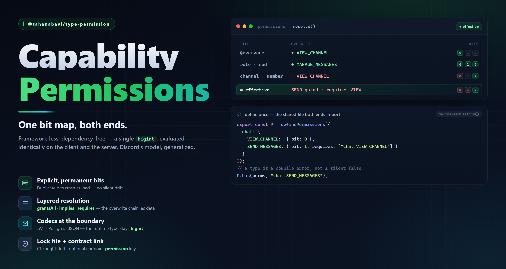

# @tahanabavi/type-permission



**Framework-less, dependency-free capability permissions.** One shared bit map,
evaluated **identically on the client and the server** by the same pure
functions — no adapters, no runtime dependencies (not even Zod), no framework
imports. It runs in a browser, Node, Bun, Deno, an edge worker, a Discord bot, or
a CLI, unchanged.

It answers *"does this actor hold capability X?"* from a `bigint` bitfield —
Discord's model, generalized. It deliberately does **not** answer *"can I edit my
own post?"*; that needs the resource, which needs a database, which needs a
framework. Keeping ownership out is what keeps this tiny. Full design rationale in
[`docs/PERMISSION.md`](../../docs/PERMISSION.md).

```bash
pnpm add @tahanabavi/type-permission
```

## Define once — the shared file both ends import

```ts
import { definePermissions } from "@tahanabavi/type-permission";

export const P = definePermissions({
  chat: {
    VIEW_CHANNEL:    { bit: 0 },
    SEND_MESSAGES:   { bit: 1, requires: ["chat.VIEW_CHANNEL"] },
    MANAGE_MESSAGES: { bit: 2, implies: ["chat.SEND_MESSAGES"] },
    ATTACH_FILES:    { bit: 3, requires: ["chat.SEND_MESSAGES"] },
  },
  guild: {
    MANAGE_ROLES:  { bit: 8 },
    KICK_MEMBERS:  { bit: 9 },
    ADMINISTRATOR: { bit: 63, grantsAll: true },
  },
});
```

Nested modules yield the same `"module.member"` id shape as `endpointId`
(typefetch) and `eventId` (typesocket). `bit` is **explicit and permanent** —
duplicate bits throw at load, and a `bigint` means there is no 64-flag ceiling.

## Check — typo-proof

```ts
P.has(perms, "chat.SEND_MESSAGES");   // a typo is a compile error, not `false`
P.hasAll(perms, ["chat.SEND_MESSAGES", "chat.ATTACH_FILES"]);
P.list(perms);                        // typed ("chat.VIEW_CHANNEL" | …)[]
P.explain(perms, "chat.SEND_MESSAGES");
// { granted: false, reason: "denied-requires",
//   detail: "chat.SEND_MESSAGES is gated by chat.VIEW_CHANNEL, which was denied." }
```

## Two ways in — progressive disclosure

```ts
// simple app: names in, effective bits out
const perms = P.from(["post.read", "post.write"]);

// scoped app (Discord's channel-overwrite chain), as data:
const perms = P.resolve([
  { allow: everyoneRole,                          source: "@everyone" },
  { allow: [roleA, roleB],                        source: "roles" },
  { allow: chOverwrite.allow, deny: chOverwrite.deny, source: "channel" },
]);
```

Each layer applies `(perms & ~deny) | allow`; allow beats deny within a tier, a
later tier beats an earlier one. Then three post-passes run in a fixed order:
`grantsAll` → `implies` → `requires` (gating, last, cascading to a fixpoint — so
"denied the channel ⇒ can do nothing in it" falls out of the model).

## Roles, and the escalation guard

```ts
const roles = P.defineRoles({
  viewer:    ["chat.VIEW_CHANNEL"],
  moderator: ["chat.VIEW_CHANNEL", "chat.MANAGE_MESSAGES"],
});

P.canGrant(actorPerms, roles.moderator); // false unless the actor holds every bit
```

`canGrant` closes the classic hole where a moderator mints an `ADMINISTRATOR`
role and assigns it to themselves.

## Framework-less by design — bindings are snippets, not packages

`createStore` implements the repo-wide `Observable<T>`, so every framework binds
it in a line of *your* code:

```ts
const store = P.createStore({ global: initialBits });

// React    useSyncExternalStore(store.subscribe, () => store.getSnapshot())
// Vue      shallowRef + store.subscribe + onScopeDispose
// Svelte   store already satisfies the Svelte store contract
// Express  (req,res,next) => P.has(req.perms, "x") ? next() : res.sendStatus(403)
// Next mw  P.has(P.decode(cookie, "base64url"), "x")
```

Reads are synchronous (a render can't await); **loading is not the store's job** —
fetch with `query-core` (or SSR) and push results in via `set` / `setScope`. An
unknown scope falls back to `global`, keeping every check total. Scoped
resolution memoizes via `P.createResolver({ compute, ttl, version })`, keyed by
`actor · scope · version` so an epoch bump invalidates an actor's whole scope set
at once.

## Storage is a codec, never a second mode

The runtime value is always `bigint`; representations sit at the IO boundary:

```ts
P.encode(perms, "base64url"); // JWT claim / cookie — smallest
P.encode(perms, "decimal");   // Postgres numeric/text; Discord-compatible
P.encode(perms, "names");     // ["chat.SEND_MESSAGES", …] — the JSON mode
P.decode(claim, "base64url"); // → bigint, on any runtime
```

Binary codecs (`decimal` · `hex` · `base64url` · `chunks`) are **lossless** —
they carry unknown (newer-version) bits through untouched, so a service on an old
version never silently revokes what a newer one granted. `names` / `grouped` are
human-readable and lossy for unknown bits by nature.

## Contract link (optional, additive)

A transport endpoint may carry an inline requirement; nothing changes for
endpoints without one:

```ts
deleteMessage: {
  method: "DELETE", path: "/messages/:id",
  request, response,
  permission: { require: ["chat.MANAGE_MESSAGES"] }, // ← the flag, written once
}
```

`P.authorize(perms, endpoint.permission)` returns a decision rich enough to build
both a `403` body and an audit-log line — the same evaluation the client uses to
pre-block the call and grey out the button. The NestJS guard that reads this key
lives in [`@tahanabavi/typewire-nestjs`](../nestjs), never here.

## Cross-project & polyglot

```ts
P.buildLock();          // permissions.lock.json — a name→bit manifest
P.diffLock(previous);   // [] when safe; flags bit-reuse / bit-change / removal — fail CI
P.catalog();            // rows for a role-editor UI (hidden flags omitted)
```

The lock file is the interop artifact: a Go or Python service needs only it plus
three lines of bit math, and CI catches any consumer drifting from it.

## Exports

`definePermissions` · `createStore` · `createResolver`, plus the `Permissions`,
`FlagDef`, `PermissionTree`, `FlagName`, `Layer`, `PermissionRequirement`,
`AuthorizeDecision`, `Observable`, `StoreSnapshot`, `Codec`, `Encoded`, `Lock`,
`LockViolation`, `CatalogEntry`, and `ExplainResult` types.

## Trust boundary

Client-side checks are **UX only** — the server recomputes from the session on
every request; a bitfield in a cookie is a cache, never an input to a decision. A
bit's meaning is **permanent** (rename freely, never reuse). Capability ≠
ownership: `has(MANAGE_MESSAGES) || msg.authorId === me.id` — the second half is
your app's.

## License

[MIT](../../LICENSE) © Taha Nabavi
