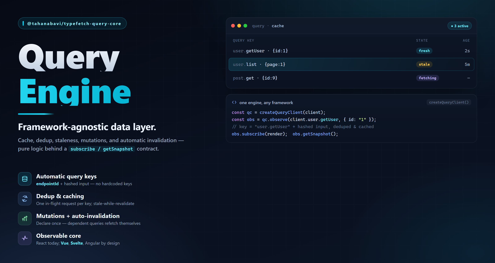

# @tahanabavi/typefetch-query-core



A framework-agnostic **query engine** for TypeWire contracts — cache, dedup,
staleness, mutations, and **declared invalidation** — over HTTP **and**
WebSocket alike, because it needs nothing but a callable endpoint carrying a
stable id.

It imports no framework and no transport. Pair it with an adapter
([`@tahanabavi/typefetch-react`](../react)) for hooks, or drive it directly
through its `Observable` contract (`subscribe` / `getSnapshot`) — the same seam a
Vue or Angular adapter would bind.

```bash
pnpm add @tahanabavi/typefetch-query-core
```

## Setup

The client is the whole setup surface. Declare invalidation **once**, here — no
call site downstream ever names a cache key:

```ts
import { QueryClient } from '@tahanabavi/typefetch-query-core'
import { api } from './api' // a typefetch ApiClient

const client = new QueryClient({
  relations: { 'user.updateUser': ['user.getUser'] },
})
```

`relations` reads `"<mutation id>": ["<query id>", …]`. The id is the contract's
own stable `endpointId` (typesocket calls it `eventId`) — the engine resolves
either, which is exactly why the same client drives both transports.

### Cross-tab seams

Two more options exist for adapters that mirror the cache across tabs or replay
it offline. Both are additive — leave them off and the engine runs exactly as
above.

```ts
import { collectSources } from '@tahanabavi/typefetch-query-core'

const client = new QueryClient({
  // Wrap every fetch and mutation. Run the request, or resolve without it to
  // hand back a value another tab already broadcast.
  gate: (ctx, run) => run(),
  // Turn an endpoint id back into its endpoint, so an inbound mirror can write
  // through the typed `setQueryData` — even for an endpoint this tab has yet to
  // mount. `collectSources` builds the map from a client's `.modules` tree.
  sources: collectSources(api.modules),
})
```

`setQueryData` takes a matching `{ updatedAt }` so a mirrored value keeps the
origin's timestamp rather than looking freshly fetched. Each of these is a hook
a sync or offline adapter attaches to; none is needed to use the engine on its
own.

## Reading

```ts
// Imperative: fetch (dedups an in-flight request for the same key), or read the
// cache without triggering one.
await client.prefetchQuery(api.modules.user.getUser, { path: { id: '1' } })
const user = client.getQueryData(api.modules.user.getUser, {
  path: { id: '1' },
})

// Reactive: an observer is what an adapter wraps — subscribe + getSnapshot.
const observer = client.watchQuery(api.modules.user.getUser, {
  path: { id: '1' },
})
const unsubscribe = observer.subscribe(() => render(observer.getSnapshot()))
```

Two arguments — endpoint and input — no query key, no query function.

## Writing

A mutation runs the write and then triggers whatever the client declared for it:

```ts
const rename = client.watchMutation(api.modules.user.updateUser)
await rename.mutateAsync({ path: { id: '1' }, body: { name: 'Ada' } })
// "user.getUser" is invalidated automatically; any watching query refetches.
```

Because the engine only calls `endpoint(input)` and reads its id, the same
`watchMutation` drives a typesocket acked event without changing anything:

```ts
const send = client.watchMutation(socket.modules.chat.sendMessage)
```

## What's in it

- **Cache & dedup** — one entry per endpoint + input; concurrent fetchers for the
  same key share a single request.
- **Staleness** — `staleTime` / `gcTime`; a stale entry refetches on the next
  observe, an unused one is garbage-collected.
- **Mutations & declared invalidation** — the `relations` map (static or a
  function of `{ variables, data }`), plus per-call `invalidates` — never a
  hand-written key.
- **Retry** — configurable `retry` / `retryDelay` on queries and mutations, with a
  `CancelledError` for aborted in-flight work.
- **`Observable` contract** — every observer, and the cache itself, expose
  `subscribe` / `getSnapshot`, so `useSyncExternalStore` (or any framework's
  equivalent) binds without a shim.
- **Filters** — `invalidateQueries` / `refetchQueries` / `cancelQueries` /
  `removeQueries` take `{ endpointId, input, predicate }`.
- **A cache event bus** — `client.subscribe(event => …)` powers devtools,
  persistence, and logging without wrapping the engine.
- **Cross-tab seams** — a `gate` wraps every fetch and mutation, `sources`
  resolves an id back to its endpoint, and the `removed` event carries a
  `reason` (`"gc"` vs `"explicit"`). The hooks a sync or offline adapter needs,
  all zero-cost when unused.

## Adapters

- [`@tahanabavi/typefetch-react`](../react) — `useQuery` / `useMutation` /
  `TypeFetchProvider`.
- [`@tahanabavi/type-devtools-core`](../devtools-core) — `connectQueryClient`
  mirrors the cache into an inspector panel.

Vue and Angular adapters are the same `Observable` contract — by design.

## License

[MIT](../../LICENSE) © Taha Nabavi
