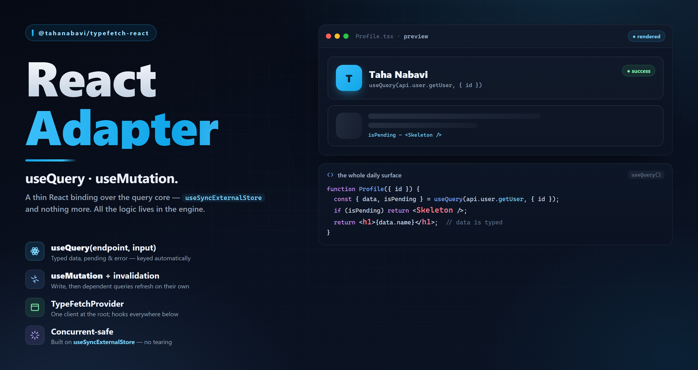

# @tahanabavi/typefetch-react



The **React** adapter for [`@tahanabavi/typefetch-query-core`](../query-core):
`useQuery`, `useMutation`, and a provider. Deliberately thin — the engine already
exposes `subscribe` / `getSnapshot`, so each hook is that contract handed to
`useSyncExternalStore`. All caching, staleness, and invalidation live in the
core.

```bash
pnpm add @tahanabavi/typefetch-react
```

React `>=18` is a peer dependency (the hooks rely on `useSyncExternalStore`).
`@tahanabavi/typefetch-query-core` is re-exported, so a `QueryClient` needs no
second direct dependency.

## Setup

Build a client (declaring invalidation once) and put it in scope:

```tsx
import { QueryClient, TypeFetchProvider } from "@tahanabavi/typefetch-react";
import { api } from "./api"; // a typefetch ApiClient

const client = new QueryClient({
  relations: { "user.updateUser": ["user.getUser"] },
});

export function Root() {
  return (
    <TypeFetchProvider client={client}>
      <App />
    </TypeFetchProvider>
  );
}
```

## useQuery

Endpoint and input — no cache key, no query function:

```tsx
import { useQuery } from "@tahanabavi/typefetch-react";

function UserCard({ id }: { id: string }) {
  const user = useQuery(api.modules.user.getUser, { path: { id } }, {
    staleTime: 30_000,
  });

  if (user.isLoading) return <p>loading…</p>;
  if (user.isError) return <p>{user.error?.message}</p>;
  return <p>{user.data?.name}</p>; // data is inferred from the contract
}
```

Changing `input` switches to that key's cache entry; a revisit is served from
cache until it goes stale.

## useMutation

Returns `mutate` (fire-and-forget) and `mutateAsync` (awaitable). No `onSuccess`
refetch and no key — the client's declared `relations` refetch the watching query
for you:

```tsx
import { useMutation } from "@tahanabavi/typefetch-react";

function RenameButton({ id }: { id: string }) {
  const rename = useMutation(api.modules.user.updateUser);
  return (
    <button
      disabled={rename.isPending}
      onClick={() => rename.mutate({ path: { id }, body: { name: "Ada" } })}
    >
      {rename.isPending ? "saving…" : "rename"}
    </button>
  );
}
```

Because the engine is transport-agnostic, the **same** hook drives a typesocket
acked event — `useMutation(socket.modules.chat.sendMessage)` is just another
source, in the same cache.

## API

| Export | |
| --- | --- |
| `TypeFetchProvider` | Puts one `QueryClient` in scope. |
| `useQueryClient` | The client from the nearest provider (throws if absent). |
| `useQuery` | Subscribe to one endpoint + input. |
| `useMutation` | A write plus its declared invalidation. |
| *(re-exports)* | `QueryClient`, `createQueryClient`, and the core's types. |

## License

[MIT](../../LICENSE) © Taha Nabavi
