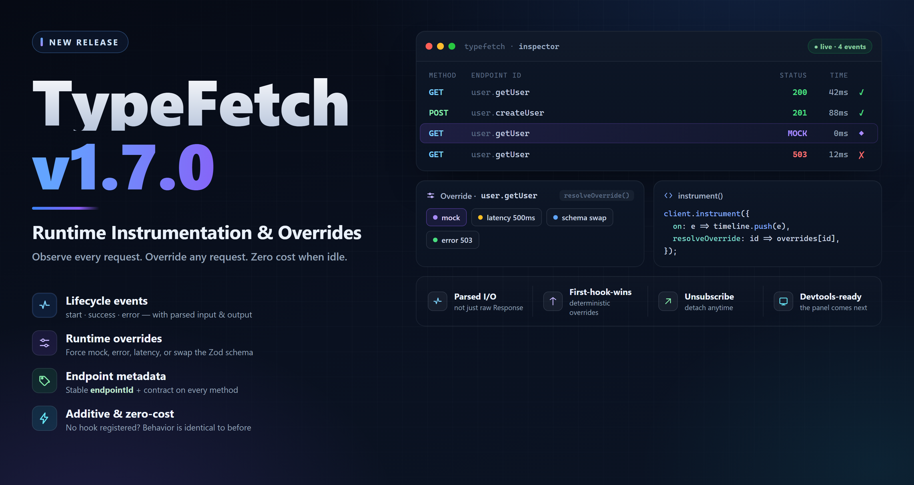

# TypeFetch



**TypeFetch** is a strongly typed HTTP client for TypeScript projects, built around **Zod** contracts.

Define your API once with Zod schemas, then TypeFetch generates a fully typed client with request validation, response validation, middleware support, retries, mock data, response wrappers, token handling, structured request support, contract-driven API testing, CLI workflows, and report generation.

```ts
const user = await api.user.getUser({
  path: { id: "123" },
});
```

> **Using NestJS on the backend?** [`@tahanabavi/typefetch-nestjs`](https://github.com/tahanabavi/typefetch-nestjs) validates the same contracts server-side. See [Backend (NestJS)](#backend-nestjs).

---

## Features

* End-to-end TypeScript inference from Zod schemas
* Runtime request and response validation
* Structured request model: `{ path, query, body, headers }`
* Automatic path parameter injection
* Automatic query string generation
* JSON and `form-data` request bodies
* Middleware pipeline
* Built-in retry engine with backoff strategies
* Timeout and `AbortController` support
* Static tokens and dynamic token providers
* Mock mode for development and testing
* Response wrapper support for API envelopes
* Normalized error handling with `RichError`
* Typed per-endpoint error responses via an optional `errors` map
* Stable endpoint identifiers and contract metadata on every generated method
* Runtime instrumentation with structured request lifecycle events
* Per-request runtime overrides for mock, error, latency, and schema swapping
* Field-level encryption middleware
* Backward-compatible flat request schemas
* Contract-driven API test runner
* Automatic test input generation from Zod schemas
* Schema, mock, live, and full API test modes
* Markdown, HTML, and JSON test reports
* CLI commands for project setup, endpoint listing, API testing, and release documentation
* Versioned release documentation under `docs/releases`

---

## What's New in v1.7.0

TypeFetch adds an **additive instrumentation layer**. Every generated method now
carries stable metadata (`endpointId` + the original `endpoint`), and
`client.instrument(...)` exposes structured lifecycle events (with parsed input
and parsed output) plus optional per-request **overrides** — force a mock,
simulate an error/latency, or swap the request/response schema at runtime,
without touching the contract.

When no hook is registered, request handling is byte-for-byte identical to
before. See [Instrumentation & Runtime Overrides](#instrumentation--runtime-overrides)
and [`docs/releases/v1.7.0.md`](./docs/releases/v1.7.0.md).

---

## What's New in v1.6.0

TypeFetch now includes a contract-driven testing layer and CLI tooling.

### Testing runner

The testing runner can discover endpoints from your contracts, generate valid request inputs, run schema/mock/live checks, validate responses, and export reports.

Supported modes:

* `schema` — validates generated or custom request input without network calls
* `mock` — validates endpoint `mockData` against the response schema
* `live` — executes real requests through `ApiClient`
* `full` — runs schema, mock, and live phases where applicable

### CLI

The CLI provides a simple workflow for setting up and running contract tests.

```bash
typefetch init
typefetch test --mode full --format markdown,json,html --output ./typefetch-report/report
typefetch list
```

### Endpoint test metadata

Endpoints can now include optional `test` metadata for custom inputs, tags, expected errors, destructive endpoint safety, and context-based flows.

```ts
getUserById: {
  method: "GET",
  path: "/users/:id",
  request: z.object({
    path: z.object({
      id: z.string(),
    }),
  }),
  response: z.object({
    id: z.string(),
    name: z.string(),
  }),
  test: {
    tags: ["user", "smoke"],
    input: {
      path: {
        id: "user-1",
      },
    },
  },
}
```

---

## Installation

```bash
npm install @tahanabavi/typefetch zod
```

Or with Yarn:

```bash
yarn add @tahanabavi/typefetch zod
```

Or with pnpm:

```bash
pnpm add @tahanabavi/typefetch zod
```

---

## Quick Start

```ts
import { z } from "zod";
import { ApiClient } from "@tahanabavi/typefetch";

const contracts = {
  user: {
    getUser: {
      method: "GET",
      path: "/users/:id",
      auth: true,
      request: z.object({
        path: z.object({
          id: z.string(),
        }),
      }),
      response: z.object({
        id: z.string(),
        name: z.string(),
      }),
    },
  },
} as const;

const client = new ApiClient(
  {
    baseUrl: "https://api.example.com",
    tokenProvider: async () => "your-token",
  },
  contracts,
);

client.init();

const api = client.modules;

const user = await api.user.getUser({
  path: { id: "123" },
});

console.log(user.name);
```

---

## Defining API Contracts

A TypeFetch contract is a grouped object of modules and endpoints.

```ts
const contracts = {
  user: {
    getUser: {
      method: "GET",
      path: "/users/:id",
      request: z.object({
        path: z.object({
          id: z.string(),
        }),
      }),
      response: z.object({
        id: z.string(),
        name: z.string(),
      }),
    },

    createUser: {
      method: "POST",
      path: "/users",
      request: z.object({
        body: z.object({
          name: z.string(),
          email: z.string().email(),
        }),
      }),
      response: z.object({
        id: z.string(),
        name: z.string(),
        email: z.string(),
      }),
    },
  },
} as const;
```

After calling `client.init()`, TypeFetch generates typed methods:

```ts
await api.user.getUser({
  path: { id: "123" },
});

await api.user.createUser({
  body: {
    name: "Taha",
    email: "taha@example.com",
  },
});
```

---

## Structured Request Model

The recommended request shape is:

```ts
z.object({
  path: z.object({}).optional(),
  query: z.object({}).optional(),
  body: z.any().optional(),
  headers: z.record(z.string(), z.string()).optional(),
});
```

Each section has a specific purpose.

| Key       | Purpose                                    |
| --------- | ------------------------------------------ |
| `path`    | Replaces path parameters like `/users/:id` |
| `query`   | Builds the query string                    |
| `body`    | Sent as the JSON or `form-data` body       |
| `headers` | Per-request headers                        |

Example:

```ts
const contracts = {
  user: {
    updateUser: {
      method: "PATCH",
      path: "/users/:id",
      request: z.object({
        path: z.object({
          id: z.string(),
        }),
        query: z.object({
          notify: z.boolean().optional(),
        }).optional(),
        body: z.object({
          name: z.string(),
        }),
        headers: z.record(z.string(), z.string()).optional(),
      }),
      response: z.object({
        id: z.string(),
        name: z.string(),
      }),
    },
  },
} as const;
```

Usage:

```ts
await api.user.updateUser({
  path: { id: "123" },
  query: { notify: true },
  headers: {
    "X-Tenant": "main",
  },
  body: {
    name: "Taha",
  },
});
```

TypeFetch sends:

```ts
PATCH /users/123?notify=true
```

With body:

```json
{
  "name": "Taha"
}
```

---

## Request Schema Helper

You can use `makeRequestSchema` to make structured request schemas easier to write.

```ts
import { z } from "zod";
import { makeRequestSchema } from "@tahanabavi/typefetch";

const updateUserRequest = makeRequestSchema<
  { id: z.ZodString },
  { notify: z.ZodOptional<z.ZodBoolean> },
  z.ZodObject<{
    name: z.ZodString;
  }>
>()({
  path: z.object({
    id: z.string(),
  }),
  query: z.object({
    notify: z.boolean().optional(),
  }),
  body: z.object({
    name: z.string(),
  }),
  headers: z.record(z.string(), z.string()).optional(),
});
```

Use it inside an endpoint:

```ts
const contracts = {
  user: {
    updateUser: {
      method: "PATCH",
      path: "/users/:id",
      request: updateUserRequest,
      response: z.object({
        id: z.string(),
        name: z.string(),
      }),
    },
  },
} as const;
```

---

## Backward Compatibility

Flat request schemas are still supported.

```ts
const contracts = {
  user: {
    createUser: {
      method: "POST",
      path: "/users",
      request: z.object({
        name: z.string(),
      }),
      response: z.object({
        id: z.string(),
        name: z.string(),
      }),
    },
  },
} as const;
```

Usage:

```ts
await api.user.createUser({
  name: "Taha",
});
```

For non-`GET` requests, the full flat input is sent as the JSON body.

For `GET` requests, flat input is validated but no body is sent.

---

## Creating the Client

```ts
import { ApiClient } from "@tahanabavi/typefetch";

const client = new ApiClient(
  {
    baseUrl: "https://api.example.com",
  },
  contracts,
);

client.init();

const api = client.modules;
```

Always call `client.init()` before using `client.modules`.

---

## Client Configuration

```ts
const client = new ApiClient(
  {
    baseUrl: "https://api.example.com",
    token: "static-token",
    tokenProvider: async () => "dynamic-token",
    useMockData: false,
    mockDelay: {
      min: 200,
      max: 1000,
    },
  },
  contracts,
);
```

| Option          | Type                              | Description            |
| --------------- | --------------------------------- | ---------------------- |
| `baseUrl`       | `string`                          | Base API URL           |
| `token`         | `string`                          | Static bearer token    |
| `tokenProvider` | `() => string \| Promise<string>` | Dynamic token provider |
| `useMockData`   | `boolean`                         | Enables mock mode      |
| `mockDelay`     | `{ min: number; max: number }`    | Simulated mock latency |

When both `token` and `tokenProvider` are provided, `tokenProvider` takes priority.

---

## Authentication

Set `auth: true` on endpoints that require an authorization token.

```ts
const contracts = {
  user: {
    getProfile: {
      method: "GET",
      path: "/profile",
      auth: true,
      request: z.object({}),
      response: z.object({
        id: z.string(),
        name: z.string(),
      }),
    },
  },
} as const;
```

Use a static token:

```ts
const client = new ApiClient(
  {
    baseUrl: "https://api.example.com",
    token: "my-token",
  },
  contracts,
);
```

Or use a dynamic token provider:

```ts
const client = new ApiClient(
  {
    baseUrl: "https://api.example.com",
    tokenProvider: async () => {
      return localStorage.getItem("token") ?? "";
    },
  },
  contracts,
);
```

You can also set the token provider later:

```ts
client.setTokenProvider(async () => "new-token");
```

---

## Middleware System

TypeFetch supports middleware for logging, authentication, caching, retries, encryption, and custom request behavior.

```ts
client.use(async (ctx, next) => {
  console.log("Request:", ctx.url);

  const response = await next();

  console.log("Response:", response.status);

  return response;
});
```

Middlewares run in registration order before the request, then unwind in reverse order after the response.

```ts
client.use(firstMiddleware);
client.use(secondMiddleware);
```

Execution flow:

```txt
firstMiddleware before
secondMiddleware before
fetch
secondMiddleware after
firstMiddleware after
```

---

## Built-in Middlewares

Depending on how you export your middlewares, they can be registered directly or as factories.

Direct middleware example:

```ts
client.use(loggingMiddleware, {
  debug: true,
  logRequest: true,
  logResponse: true,
});
```

Factory middleware example:

```ts
client.use(cacheMiddleware({ ttl: 60_000 }));
client.use(retryMiddleware({ maxRetries: 3, delay: 300 }));
```

---

## Retry Engine

TypeFetch includes a built-in retry engine on the client.

```ts
client.setRetryConfig({
  maxRetries: 3,
  backoff: "exponential",
  retryCondition: (error, attempt) => {
    return error.status !== undefined && error.status >= 500;
  },
});
```

Supported backoff strategies:

| Strategy      | Behavior                       |
| ------------- | ------------------------------ |
| `fixed`       | Same delay each retry          |
| `linear`      | Delay increases linearly       |
| `exponential` | Delay doubles after each retry |

Example:

```ts
client.setRetryConfig({
  maxRetries: 3,
  backoff: "fixed",
});
```

---

## Timeout and Abort Support

Each request can receive per-call options.

```ts
await api.user.getUser(
  {
    path: { id: "123" },
  },
  {
    timeout: 5000,
  },
);
```

You can also pass an external `AbortSignal`.

```ts
const controller = new AbortController();

await api.user.getUser(
  {
    path: { id: "123" },
  },
  {
    signal: controller.signal,
  },
);

controller.abort();
```

---

## Mock Mode

Mock mode lets you return endpoint-level mock data instead of calling the network.

```ts
const contracts = {
  user: {
    getUser: {
      method: "GET",
      path: "/users/:id",
      request: z.object({
        path: z.object({
          id: z.string(),
        }),
      }),
      response: z.object({
        id: z.string(),
        name: z.string(),
      }),
      mockData: {
        id: "mock-1",
        name: "Mock User",
      },
    },
  },
} as const;
```

Enable mock mode:

```ts
client.setMockMode(true, {
  min: 200,
  max: 1000,
});
```

Dynamic mock data is also supported:

```ts
mockData: () => ({
  id: crypto.randomUUID(),
  name: "Dynamic Mock User",
});
```

Mock responses are still validated against the endpoint response schema.

---

## Response Wrappers

Many APIs return wrapped responses.

```json
{
  "success": true,
  "data": {
    "id": "123",
    "name": "Taha"
  },
  "timestamp": "2026-01-01T00:00:00.000Z"
}
```

TypeFetch can validate and unwrap these responses.

```ts
import { z } from "zod";

client.setResponseWrapper((successResponse) =>
  z.union([
    z.object({
      success: z.literal(true),
      data: successResponse,
      timestamp: z.string().optional(),
      requestId: z.string().optional(),
    }),
    z.object({
      success: z.literal(false),
      message: z.string(),
      code: z.number().optional(),
      timestamp: z.string().optional(),
      requestId: z.string().optional(),
    }),
  ]),
);
```

Successful responses return only `data`.

Failed wrapped responses throw `RichError`.

---

## Error Handling

TypeFetch normalizes errors into `RichError`.

```ts
client.onError((error) => {
  console.error(error.message);
  console.error(error.status);
  console.error(error.code);
});
```

`RichError` may include:

```ts
{
  message: string;
  status?: number;
  code?: string;
  title?: string;
  detail?: string;
  errors?: Record<string, string[]>;
}
```

Handled error types include:

* HTTP errors
* Validation errors
* Wrapped API errors
* Missing token errors
* Network errors
* Timeout errors
* Retry exhaustion

Example:

```ts
try {
  await api.user.getUser({
    path: { id: "missing" },
  });
} catch (error) {
  if (error instanceof RichError) {
    console.error(error.status, error.message);
  }
}
```

---

## Typed Error Responses

An endpoint declares its **success** (`2xx`) body via `response`. You can optionally declare the body of **error** responses with an `errors` map keyed by HTTP status code. Each value is a plain Zod schema.

```ts
createUser: {
  method: "POST",
  path: "/users",
  request: z.object({ body: z.object({ email: z.string().email() }) }),
  response: z.object({ id: z.string() }),
  errors: {
    409: z.object({ code: z.literal("EMAIL_TAKEN"), conflictField: z.string() }),
    422: z.object({ code: z.literal("INVALID"), issues: z.array(z.string()) }),
  },
}
```

This is fully backward compatible: endpoints without `errors` behave exactly as before.

### Typed error bodies on the client

When a request fails and a schema is declared for the response status, the client parses the body and attaches it to `RichError.data`. Use the `isContractError` guard to narrow a caught error to a specific status and get a fully typed `data`.

```ts
import { isContractError } from "@tahanabavi/typefetch";
import { contracts } from "./contracts";

try {
  await api.user.createUser({ body: { email } });
} catch (e) {
  if (isContractError(contracts.user.createUser, e, 409)) {
    e.data.conflictField; // fully typed from the 409 schema
  }
}
```

`isContractError(endpoint, error, status)` returns `true` only when `error` is a `RichError` whose `status` matches **and** whose body actually validated against the declared schema (`RichError.dataParsed === true`). This keeps the narrowed type honest: if the server returns that status with a body that doesn't match the contract, the guard returns `false` instead of claiming `error.data` has a shape it doesn't.

### Fail-open parsing

Error typing never masks the real error:

* If no schema is declared for the status, `RichError.data` holds the **raw** JSON body and `RichError.dataParsed` is `false`.
* If the body does not match the declared schema, `RichError.data` falls back to the **raw** JSON body and `RichError.dataParsed` is `false`.
* Only when a schema is declared and the body passes it is `RichError.dataParsed` `true` and `RichError.data` the parsed, typed body.
* All existing `RichError` fields (`message`, `status`, `code`, `title`, `detail`, `errors`) are unchanged.

### Type helpers

```ts
import type { InferError, InferErrors } from "@tahanabavi/typefetch";

type Conflict = InferError<typeof contracts.user.createUser, 409>;
// { code: "EMAIL_TAKEN"; conflictField: string }

type AllErrors = InferErrors<typeof contracts.user.createUser>;
// { 409: {...}; 422: {...} }
```

External tools (such as [`@tahanabavi/typefetch-nestjs`](https://github.com/tahanabavi/typefetch-nestjs)) can iterate `endpoint.errors` to emit an OpenAPI `responses[status]` entry per declared error and validate error bodies against the contract.

---

## File Uploads

Set `bodyType: "form-data"` on an endpoint.

```ts
const contracts = {
  user: {
    uploadAvatar: {
      method: "POST",
      path: "/users/:id/avatar",
      bodyType: "form-data",
      request: z.object({
        path: z.object({
          id: z.string(),
        }),
        body: z.object({
          file: z.instanceof(File),
          alt: z.string().optional(),
        }),
      }),
      response: z.object({
        uploaded: z.boolean(),
      }),
    },
  },
} as const;
```

Usage:

```ts
await api.user.uploadAvatar({
  path: { id: "123" },
  body: {
    file,
    alt: "Profile avatar",
  },
});
```

When using `form-data`, TypeFetch does not force the `Content-Type: application/json` header.

---

## Encryption Middleware

TypeFetch includes optional field-level encryption through `encryptionMiddleware`.

It can:

* Encrypt selected request body fields
* Decrypt selected response fields
* Process deeply nested objects
* Process arrays
* Use different encryption methods per field
* Support custom encryption and decryption handlers

Supported methods:

```ts
type EncryptionMethod = "AES" | "DES" | "RSA" | "Base64" | "Custom";
```

### Registering the Middleware

```ts
import { encryptionMiddleware } from "@tahanabavi/typefetch/middlewares";

client.use(encryptionMiddleware, {
  keyProvider: async () => ({
    type: "symmetric",
    key: "my-secret-key",
  }),
});
```

### Endpoint Encryption Config

```ts
const contracts = {
  secure: {
    createSecret: {
      method: "POST",
      path: "/secure",
      request: z.object({
        body: z.object({
          secret: z.string(),
          profile: z.object({
            pin: z.string(),
          }),
        }),
      }),
      response: z.object({
        id: z.string(),
        token: z.string(),
      }),
      encryption: {
        method: "AES",
        request: {
          secret: true,
          profile: {
            pin: "Base64",
          },
        },
        response: {
          token: true,
        },
      },
    },
  },
} as const;
```

Usage:

```ts
await api.secure.createSecret({
  body: {
    secret: "private-value",
    profile: {
      pin: "1234",
    },
  },
});
```

Before the request is sent:

* `secret` is encrypted with AES
* `profile.pin` is encoded with Base64

After the response is received:

* `token` is decrypted with AES

### Separate Request and Response Methods

```ts
encryption: {
  method: {
    request: "RSA",
    response: "AES",
  },
  request: {
    password: true,
  },
  response: {
    token: true,
  },
}
```

### Custom Encryption

```ts
client.use(encryptionMiddleware, {
  keyProvider: async () => ({
    type: "symmetric",
    key: "custom-key",
  }),
  customHandlers: {
    encrypt: async (value, key) => {
      return `encrypted:${value}`;
    },
    decrypt: async (value, key) => {
      return value.replace("encrypted:", "");
    },
  },
});
```

Endpoint config:

```ts
encryption: {
  method: "Custom",
  request: {
    secret: true,
  },
  response: {
    token: true,
  },
}
```

### Fail-Closed Behavior

By default, encryption should fail closed.

That means if request encryption fails, the request is not sent as plaintext.

```ts
client.use(encryptionMiddleware, {
  keyProvider: async () => ({
    type: "symmetric",
    key: "secret",
  }),
  failClosed: true,
});
```

For debugging, you may disable fail-closed behavior:

```ts
client.use(encryptionMiddleware, {
  keyProvider: async () => ({
    type: "symmetric",
    key: "secret",
  }),
  failClosed: false,
});
```

Use `failClosed: false` carefully.

---

## Encryption Maps

Encryption maps describe which fields should be transformed.

```ts
encryption: {
  method: "AES",
  request: {
    password: true,
    profile: {
      ssn: true,
    },
    metadata: {
      publicValue: false,
    },
  },
}
```

Map values:

| Value      | Behavior                             |
| ---------- | ------------------------------------ |
| `true`     | Encrypt/decrypt using default method |
| `false`    | Skip field                           |
| `"AES"`    | Use AES for this field               |
| `"DES"`    | Use DES for this field               |
| `"RSA"`    | Use RSA for this field               |
| `"Base64"` | Use Base64 for this field            |
| `"Custom"` | Use custom handler                   |
| `{ ... }`  | Recursively process object           |
| `[ ... ]`  | Process array items                  |

Array example:

```ts
encryption: {
  method: "AES",
  request: {
    users: [
      {
        password: true,
      },
    ],
  },
}
```

This applies the first array map to every item unless an index-specific map exists.

---

## Endpoint-Level Headers

Headers can be defined on the endpoint.

```ts
const contracts = {
  user: {
    createUser: {
      method: "POST",
      path: "/users",
      request: z.object({
        body: z.object({
          name: z.string(),
        }),
      }),
      response: z.object({
        id: z.string(),
        name: z.string(),
      }),
      headers: {
        "X-App": "typefetch",
      },
    },
  },
} as const;
```

Headers can also be generated from input:

```ts
headers: (input) => ({
  "X-Tenant": input.headers?.["X-Tenant"] ?? "default",
});
```

Per-request headers can be passed through the structured request input:

```ts
await api.user.createUser({
  headers: {
    "X-Request-ID": "req-123",
  },
  body: {
    name: "Taha",
  },
});
```

---

## Custom Middleware

A middleware receives:

```ts
type Middleware = (
  ctx: MiddlewareContext,
  next: () => Promise<Response>,
  options?: unknown,
) => Promise<Response>;
```

Example:

```ts
client.use(async (ctx, next) => {
  const startedAt = Date.now();

  const response = await next();

  console.log(`${ctx.init.method} ${ctx.url} took ${Date.now() - startedAt}ms`);

  return response;
});
```

With options:

```ts
const timingMiddleware = async (ctx, next, options) => {
  const response = await next();

  if (options?.debug) {
    console.log("Timing middleware enabled");
  }

  return response;
};

client.use(timingMiddleware, {
  debug: true,
});
```

---

## Instrumentation & Runtime Overrides

Beyond middleware (which only sees the raw `Response`), TypeFetch exposes an
optional instrumentation layer that reports the **parsed** input and **parsed**
output of every request and can override a request at runtime. It's designed for
tooling — a devtools/inspector or a query layer — and is fully additive: with no
hook registered, request handling is unchanged.

### Endpoint metadata

Every generated method carries stable, read-only metadata:

```ts
const api = client.modules;

api.user.getUser.endpointId; // "user.getUser"
api.user.getUser.endpoint;   // the original contract def (schemas, method, path, ...)
```

### Lifecycle events

Register a hook with `client.instrument(...)`; it returns an unsubscribe
function.

```ts
const stop = client.instrument({
  on(event) {
    // event.type: "start" | "success" | "error"
    // start:   { requestId, endpointId, method, url, input, timestamp }
    // success: { requestId, endpointId, data, durationMs, fromMock }
    // error:   { requestId, endpointId, status?, error, durationMs }
    console.log(event.type, event.endpointId);
  },
});

stop(); // detach later
```

`requestId` correlates a request's `start` with its `success`/`error`.

### Runtime overrides

A hook can resolve a per-request `Override` to change what a single request does
**without mutating the contract**. The first hook to return an override wins.

```ts
client.instrument({
  resolveOverride(endpointId, input) {
    if (endpointId === "user.getUser") {
      return { mock: { id: "forced", name: "Forced User" } };
    }
  },
});
```

```ts
type Override = {
  mock?: unknown | ((input: unknown) => unknown); // force mock, bypass network
  error?: { status?: number; code?: string; message?: string; body?: unknown }; // simulate failure
  latencyMs?: number;                              // inject latency
  request?: z.ZodTypeAny;                          // swap request schema at runtime
  response?: z.ZodTypeAny;                         // swap response schema at runtime
};
```

* `mock` bypasses the network regardless of mock mode and is still validated
  against the (possibly overridden) response schema.
* `error` throws a `RichError` and fires `onError`, like a real failing endpoint.
* `latencyMs` is awaited before the request resolves.
* `request` / `response` swap the validation schema for that request only, so you
  can test structural changes at runtime.

Fields are independent and compose. Full details in
[`docs/releases/v1.7.0.md`](./docs/releases/v1.7.0.md).

---

## Type Inference

TypeFetch infers endpoint input and output types automatically from Zod schemas.

```ts
const user = await api.user.getUser({
  path: {
    id: "123",
  },
});
```

`user` is inferred as:

```ts
{
  id: string;
  name: string;
}
```

Invalid input fails at compile time when possible and at runtime through Zod validation.

---

Example:

```ts
// api/client.ts
import { ApiClient } from "@tahanabavi/typefetch";
import { contracts } from "./contracts";

export const client = new ApiClient(
  {
    baseUrl: import.meta.env.VITE_API_URL,
    tokenProvider: async () => localStorage.getItem("token") ?? "",
  },
  contracts,
);

client.init();

export const api = client.modules;
```

---

## Testing

TypeFetch is designed to be easy to test with mocked `fetch`.

Example:

```ts
global.fetch = vi.fn();

(fetch as any).mockResolvedValueOnce({
  ok: true,
  json: async () => ({
    id: "1",
    name: "Taha",
  }),
});

const user = await api.user.getUser({
  path: {
    id: "1",
  },
});

expect(user.name).toBe("Taha");
```

Contract-driven API testing can also be run through the TypeFetch CLI.

```bash
typefetch init
typefetch test --mode schema
typefetch test --mode mock
typefetch test --mode live --base-url http://localhost:3000
```

Generated reports can be exported as Markdown, HTML, or JSON:

```bash
typefetch test --mode full --format markdown,json,html --output ./typefetch-report/report
```

Recommended test coverage:

* Request validation
* Response validation
* Path parameter handling
* Query string generation
* JSON body serialization
* Header merging
* Auth token injection
* Token provider behavior
* Middleware execution order
* Retry behavior
* Timeout and abort behavior
* Mock mode
* Response wrappers
* Error normalization
* Encryption middleware
* Instrumentation events (start / success / error)
* Runtime overrides (mock / error / latency / schema swap)

---

## Backend (NestJS)

The official companion package [`@tahanabavi/typefetch-nestjs`](https://github.com/tahanabavi/typefetch-nestjs) lets you import the **same** `contracts` object on a NestJS backend to bind routes and validate request input and response output against each contract's Zod `request`/`response` schemas. One contract, end-to-end type-and-runtime safety — the route can't drift from the client.

Compatible with TypeFetch `>= 1.6.0`.

### Installation

```bash
npm i @tahanabavi/typefetch-nestjs @tahanabavi/typefetch zod
```

Peer dependencies: `@nestjs/common`, `@nestjs/core`, `rxjs`, `reflect-metadata`, and `zod@^4`.

### Example

```ts
import { Controller } from "@nestjs/common";
import {
  TypeFetchEndpoint,
  ContractInput,
  InferRequest,
  InferResponse,
} from "@tahanabavi/typefetch-nestjs";
import { contracts } from "./contracts";

@Controller()
export class UserController {
  @TypeFetchEndpoint(contracts.user.getUser) // GET /users/:id from the contract
  async getUser(
    @ContractInput() input: InferRequest<typeof contracts.user.getUser>,
  ): Promise<InferResponse<typeof contracts.user.getUser>> {
    return { id: input.path.id, name: "Taha" };
  }
}
```

### Core API

| Export                                                             | Purpose                                                                                                       |
| ------------------------------------------------------------------ | ------------------------------------------------------------------------------------------------------------ |
| `@TypeFetchEndpoint(contract)`                                     | Binds the HTTP method and path from the contract and wires request/response validation.                      |
| `@UseContract(contract)`                                           | Validation-only decorator for retrofitting existing `@Get`/`@Post` routes.                                   |
| `@ContractInput()`                                                 | Injects the full validated, typed input, shaped exactly like what the client passed.                         |
| `@ContractPath()` / `@ContractQuery()` / `@ContractBody()` / `@ContractHeaders()` | Inject an individual validated input section.                                                 |
| `InferRequest<T>` / `InferResponse<T>`                             | Type helpers for a contract's input and output.                                                              |
| `TypeFetchModule.forRoot({ ... })`                                 | Global options.                                                                                              |
| `getContractEndpoint(ctx)`                                         | Lets a guard read the contract, e.g. to honor its `auth` flag.                                               |

Query and path strings are auto-coerced to the contract's declared types (numbers, booleans, dates, arrays), mirroring the client's `URLSearchParams` serialization. Validation failures return a `RichError`-compatible `400` (`{ message, code, errors }`), so the client's `RichError` surfaces field errors directly.

### Mirrored features

The backend mirrors TypeFetch's client capabilities:

* **OpenAPI 3.0 / Swagger** generation from your contracts (`setupContractSwagger`, `buildOpenApiDocument`).
* **Multipart / file-upload** validation for `bodyType: "form-data"` contracts.
* **Response envelope** matching the client's `setResponseWrapper` (`{ success, data }` / `{ success, message }`).
* **Field-level encryption** mirroring `encryptionMiddleware` — decrypts request fields before validation, encrypts response fields after — byte-compatible via `crypto-js`/`node-forge`.

Full documentation lives at [`@tahanabavi/typefetch-nestjs` on GitHub](https://github.com/tahanabavi/typefetch-nestjs) and on [npm](https://www.npmjs.com/package/@tahanabavi/typefetch-nestjs).

---

## Versioned Release Documentation

Starting with v1.6.0, detailed documentation for larger updates is stored separately under `docs/releases`.

The main README stays focused on quick usage and core concepts, while release files contain deeper implementation notes, migration details, CLI examples, test strategy, and full feature explanations.

Recommended structure:

```txt
docs/
  releases/
    v1.6.0.md
    v1.6.7.md
    v1.7.0.md
```

## Notes

* Always call `client.init()` before using `client.modules`.
* All request inputs are validated with Zod.
* All successful responses are validated with Zod.
* Structured request schemas are recommended for new APIs.
* Flat request schemas are still supported for backward compatibility.
* `GET` requests do not send a body.
* `form-data` endpoints should use `bodyType: "form-data"`.
* Auth tokens are only required for endpoints with `auth: true`.
* Mock data bypasses network calls but still validates responses.
* Every generated method exposes `endpointId` and `endpoint` metadata.
* Instrumentation is opt-in; with no hook registered, request handling is unchanged.
* Runtime overrides change a single request without mutating the contract.
* Use `typefetch test --mode schema` for fast contract validation.
* Keep detailed release documentation in `docs/releases`.

---

## License

MIT
