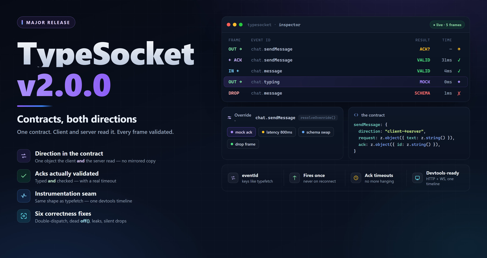

<div align="center">

</div>

# TypeSocket 2.0 — Contract-driven, both directions

This release rewrites typesocket around a **direction-tagged contract**.
`SocketService` is replaced by `SocketClient`: you declare each event once —
with the direction it travels and its Zod schemas — and the entire client
generates itself, validated on the way out *and* on the way in.

It also adds the **instrumentation seam** that `typefetch` has carried since
v1.7.0, in the same shape, so HTTP and WebSocket traffic can land in one
devtools timeline without adapter glue.

This is a breaking release, and deliberately so: several of the fixes below
could not be made without changing observable behaviour. Read
[Behaviour changes](#behaviour-changes-to-plan-for) before upgrading — a silent
behaviour change is worse than a compile error.

---

## Why direction belongs in the contract

v1 took two maps, `onEvents` and `emitEvents`, named from the **client's** point
of view. That works for a client and only a client. A server gateway consuming
the same object needs them swapped, so it had to declare a mirrored copy — and a
mirrored copy is a copy that drifts.

Tagging each event with its own `direction` makes one object readable from both
ends. The client emits `client->server` events and listens to `server->client`
ones; a server adapter does exactly the reverse, from the file the client
already imports.

```ts
import { z } from "zod";
import { defineSocketContracts } from "@tahanabavi/typesocket";

export const wsContracts = defineSocketContracts({
  chat: {
    sendMessage: {
      direction: "client->server",
      request: z.object({ roomId: z.string(), text: z.string().min(1) }),
      ack: z.object({ id: z.string(), sentAt: z.number() }),
    },
    message: {
      direction: "server->client",
      payload: z.object({ id: z.string(), text: z.string(), user: z.string() }),
    },
  },
});
```

Grouping into modules also gives every event a stable
`eventId` — `"chat.sendMessage"` — which is the *same* `"module.endpoint"` shape
`typefetch` produces. That is what lets a query cache or a devtools panel key
both transports with one scheme instead of two.

## The generated surface

```ts
const client = createSocketClient({ url: "http://localhost:3001" }, wsContracts);

// server -> client
const off = client.modules.chat.message.on((m) => console.log(m.user, m.text));

// client -> server, ack declared -> Promise of the *validated* ack
const { id } = await client.modules.chat.sendMessage({ roomId: "r1", text: "hi" });

// client -> server, no ack declared -> void
client.modules.chat.typing({ roomId: "r1", isTyping: true });
```

Whether an emit returns `Promise<Ack>` or `void` is decided by the contract, not
by which method you remembered to call. Declare `ack` and awaiting is
meaningful; omit it and the return type is `void`.

Each generated member carries metadata for tooling:

```ts
client.modules.chat.sendMessage.eventId; // "chat.sendMessage"
client.modules.chat.sendMessage.def;     // the contract definition
client.events;                           // every event, flattened
```

Contracts are validated at construction. Two events colliding on one wire name,
or a missing/unknown `direction`, throws `ERR_SOCKET_INVALID_CONTRACT` at
startup rather than surfacing later as an event that mysteriously never fires.

## Instrumentation

The single extension point, mirroring `client.instrument()` in typefetch.
Attaching a hook is the only thing that turns event construction on — with no
hook attached, the frame path is identical to the un-instrumented one.

```ts
const detach = client.instrument({
  on(event) { timeline.push(event); },
  resolveOverride(eventId, payload) {
    if (eventId === "chat.sendMessage") {
      return { latencyMs: 800, ack: { id: "mocked", sentAt: Date.now() } };
    }
  },
});
```

### Events

```ts
type SocketEvent =
  | { type: "connect";       ts: number; socketId?: string; attempt: number }
  | { type: "disconnect";    ts: number; reason: string }
  | { type: "connect_error"; ts: number; error: ErrorLike }
  | { type: "outbound";    frameId: string; eventId: string; event: string; payload: unknown; ts: number; queued: boolean; expectsAck: boolean }
  | { type: "ack";         frameId: string; eventId: string; data: unknown; durationMs: number; fromMock: boolean }
  | { type: "inbound";     frameId: string; eventId: string; event: string; payload: unknown; ts: number; injected: boolean }
  | { type: "dropped";     frameId: string; eventId: string; direction: "inbound" | "outbound"; by: "middleware" | "override"; ts: number }
  | { type: "frame_error"; frameId: string; eventId: string; direction: "inbound" | "outbound"; error: ErrorLike; ts: number };
```

`frameId` correlates an `outbound` frame with its matching `ack` or
`frame_error`, the way `requestId` does in typefetch. Payloads on these events
are the **parsed** values, not the raw wire data.

### Overrides

A hook may resolve a per-frame override, letting tooling change what one frame
does **without mutating the contract**. The first hook to return one wins.

| Field | Effect |
| --- | --- |
| `drop` | Discard the frame. An emit awaiting an ack then times out, as a genuinely lost packet would — rather than hanging forever or resolving a lie. |
| `latencyMs` | Delay the frame. |
| `payload` | Replace the payload; a function receives the original. |
| `ack` | Answer locally, bypassing the network. Still validated, so a mock can't claim a shape the contract forbids. |
| `error` | Force a failure (`SocketOverrideError`). |
| `request` / `response` | Swap a validation schema for this frame only, to test a structural change. The contract object is never mutated. |

Fields are independent and compose: a swapped `response` together with a mocked
`ack` validates the mock against the new shape.

## Correctness fixes

Each of these was a real defect in v1, and each has a regression test named
after the behaviour it prevents.

**Handlers fired twice.** `on()` registered a wrapped handler on the socket
*and* stored it for re-registration on `connect`. Because socket.io's emitter
does not de-duplicate, every handler ran twice on the **first** connection, and
once more per reconnect. v2 binds exactly one dispatcher per event and fans out
to a registry the client owns.

**`off()` could never remove anything.** It passed the user's callback while the
socket held a wrapper closure, so nothing matched. Removal now happens in the
registry, where identity is under our control.

**`waitFor()` leaked a listener per call** — same root cause — and rejected when
*any* frame on that event failed validation, so an unrelated malformed message
could cancel someone else's wait. `.wait()` now always detaches (on resolve, on
timeout, on abort) and stays armed through invalid frames. It also takes a
`filter`.

**Acks were never validated.** `EmitEvent` declared a `callback` schema and
`emitAsync` typed its return from it — then resolved the raw server value. The
type was a claim the runtime never checked. Acks are validated now, and a
non-conforming ack rejects with `SocketValidationError`.

**`emitAsync` had no timeout.** A server that never acked hung the promise
forever. Timeouts are enforced (`ackTimeoutMs`, per-client, per-event or
per-call) and `AbortSignal` is supported.

**Failures were silent.** An invalid payload was logged to `console.error` and
dropped; an emit with no connection hit `this.socket?.emit(...)` and vanished.
Both now throw typed errors — a contract violation should never be
indistinguishable from a successful send.

**`emitQueued` buffered unvalidated data** and flushed it raw. `.queue()`
validates at call time, so a malformed payload fails where you wrote it. The
buffer is bounded (`maxQueueSize`, default 100) and evicts oldest-first.

**`reconnectWithBackoff()` leaked a socket per attempt** — it called `init()`
without disconnecting — and never reset its counter. Removed; socket.io's own
backoff is configured through `reconnectionDelay` / `reconnectionDelayMax`.

**`getSocketConfig()` read bare `process.env` at import time**, which throws in a
browser bundle with no `process` shim, and hardcoded `NEXT_PUBLIC_*` inside a
framework-agnostic package. Replaced by `socketConfigFromEnv(prefix, env?)`,
which guards its environment access and only emits keys for variables that are
actually set, so it layers cleanly over explicit config.

## Also new

**Typed errors.** Every error extends `SocketError` with a stable `code` and the
`eventId` it belongs to: `SocketValidationError` (with `phase` and Zod
`issues`), `SocketAckTimeoutError`, `SocketNotConnectedError`,
`SocketWaitTimeoutError`, `SocketOverrideError`.

**Middleware in both directions.** v1's middleware saw inbound frames only and
could only observe. v2's sees both directions and may drop a frame (`false`) or
rewrite it (`{ payload }`). Rewrites run **before** validation, so middleware
cannot smuggle a payload past the contract. A middleware that throws is logged
and skipped rather than taking the frame with it.

**Lifecycle handlers are optional and subscribable.** v1 required a fourth
constructor argument with three mandatory callbacks. v2 takes an optional
options object, and `onConnect` / `onDisconnect` / `onConnectError` each return
an unsubscribe.

**Function-valued `auth`**, mapped to socket.io's callback form so it is
re-invoked on every reconnect — a refreshed token needs no new client.

**`destroy()`**, `listenerCount`, `queueSize`, `client.events`, and strict-mode
TypeScript throughout (`strict` + `noUncheckedIndexedAccess`).

## API additions

| Export | Kind | Purpose |
| --- | --- | --- |
| `SocketClient` | class | The contract-driven client. Replaces `SocketService`. |
| `createSocketClient(config, contracts, options?)` | function | Construct and connect. |
| `defineSocketContracts(contracts)` | function | Identity helper preserving literal types. |
| `SocketContracts` · `ClientToServerDef` · `ServerToClientDef` | types | The contract shape. |
| `EmitApi` · `ListenApi` · `SocketModules` | types | The generated surface. |
| `SocketEvent` · `SocketOverride` · `SocketInstrumentation` | types | The instrumentation seam. |
| `SocketMiddleware` · `SocketFrame` | types | Bidirectional middleware. |
| `SocketError` and subclasses | classes | Typed failures with stable codes. |
| `socketConfigFromEnv(prefix, env?)` | function | Prefix-driven env config. |
| `listSocketEvents` · `validateSocketContracts` · `isClientToServer` · `isServerToClient` | functions | Contract introspection for tooling and server adapters. |

## Migration

`response` becomes `payload`; `callback` becomes `ack`; the two maps merge into
one module-grouped object with a `direction` per event.

```ts
// v1
const onEvents   = { message:     { response: MessageSchema } };
const emitEvents = { sendMessage: { request: ReqSchema, callback: AckSchema } };

// v2
const wsContracts = defineSocketContracts({
  chat: {
    message:     { direction: "server->client", payload: MessageSchema },
    sendMessage: { direction: "client->server", request: ReqSchema, ack: AckSchema },
  },
});
```

| v1 | v2 |
| --- | --- |
| `new SocketService(cfg, on, emit, handlers).init()` | `new SocketClient(cfg, contracts, options).connect()` |
| `socket.on("message", fn)` | `client.modules.chat.message.on(fn)` |
| `socket.off("message", fn)` | `client.modules.chat.message.off(fn)` |
| `socket.once("message", fn)` | `client.modules.chat.message.once(fn)` |
| `socket.emit("sendMessage", d)` | `client.modules.chat.sendMessage(d)` |
| `socket.emitAsync("sendMessage", d)` | `client.modules.chat.sendMessage(d)` |
| `socket.emitQueued("sendMessage", d)` | `client.modules.chat.sendMessage.queue(d)` |
| `socket.waitFor("message", ms)` | `client.modules.chat.message.wait({ timeoutMs: ms })` |
| `socket.use(fn)` | `client.use(fn)` — now both directions, and removable |
| `socket.isConnected()` | `client.connected` |
| `socket.getSocketId()` | `client.id` |
| `socket.enableDebug()` | `debug: true` in config |
| `socket.reconnectWithBackoff()` | removed — configure `reconnectionDelay` / `reconnectionDelayMax` |
| `getSocketConfig()` | `socketConfigFromEnv(prefix)` |

### Behaviour changes to plan for

These compile fine and behave differently. They are the reason this is a major.

- **Handlers now fire once.** Code written to tolerate — or compensate for —
  the duplicate dispatch will now under-count. Remove the workaround.
- **`off()` now actually detaches.** Anything that relied on a handler surviving
  its own removal will stop working.
- **Invalid outbound payloads throw** instead of being logged and dropped. Wrap
  emits that carry user input.
- **Emits with no connection throw** `SocketNotConnectedError` instead of
  vanishing. Use `.queue()` wherever buffering was the actual intent.
- **Acks are validated and time out.** A call that previously hung forever now
  rejects; a server whose ack never matched the declared schema now surfaces
  that mismatch instead of passing an unchecked value to typed code.
- **`zod` and `socket.io-client` are peer dependencies**, and `typescript` is no
  longer a runtime dependency. Install the peers explicitly.

## Design intent

Instrumentation is deliberately the same shape in typefetch and typesocket, down
to the naming, because the layers above are meant to be transport-blind:

- the query engine keys its cache by `eventId` / `endpointId` plus the input;
- the devtools bridge attaches one hook per source and renders a single
  source-tagged timeline.

Keeping that seam thin and additive means `type-devtools-core` and
`typefetch-query-core` never fork or re-implement a transport pipeline. Making
`direction` part of the contract means `typewire-nestjs` can bind WS gateways
from the same file the client imports.

## Not in this release

- `connectTypeSocket(socket, bridge)` in `@tahanabavi/type-devtools-core`.
- NestJS WebSocket gateway decorators driven by these contracts.
- Namespace and room helpers.
- Binary / ArrayBuffer payload support.
